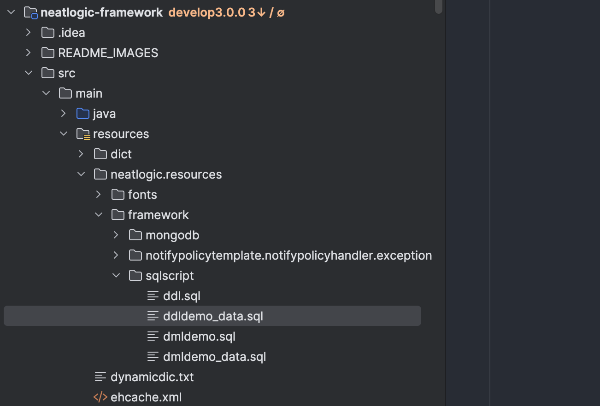

[中文](CODE-BUILD.md) / English

# Building Code

## Downloading All Project Code
To retrieve the code, check out neatlogic-itom-all to fetch all module code at once. Since neatlogic-itom-all uses submodules to include modules, you need to add the --recurse-submodules parameter when checking out the code. Example:
```
  git clone url --recurse-submodules
```

## IntelliJ IDEA Configuration
### Create a new workspace and import all projects
> Open Project

> Select the neatlogic-webroot module to open

> Then add other modules


As shown above, if the git branch number displayed on the right side of the branch module is not develop3.0.0, you need to execute the following command in the neatlogic-itom-all directory:
```
git submodule foreach 'git checkout develop3.0.0'
```
### Maven Configuration


### Configuring JDK8


### Refreshing Maven Dependencies

### Configuring Tomcat9


#### Specify Local Tomcat

#### Put mysql8's jdbc driver into Tomcat's lib directory


```
//VM Option
//nacos configuration, nacos will be used first, if can't get config, it will get from config.properties
-Dnacos.home=192.168.0.10:8848 
-Dnacos.namespace=lvzk_local 
//Log level
-Dlog4j.priority=ERROR 
-Drunmode=develop 
//Set to true, you can log in with any password after entering the username, can only be used in the development stage!
-DenableNoSecret=false 
//Set to true to enable operation and maintenance mode, you can log in as a super administrator for emergency intervention and authorization, this user has a lot of permissions, can only be used in the development stage!
-DenableSuperAdmin=true
```
#### Configure the Timing for Automatic Build

### Configure config.properties
The template for the nacos configuration file is as follows. If you do not use nacos, you need to configure it in config.properties:
``` properties
#database properties
db.driverClassName = com.mysql.cj.jdbc.Driver
db.url = jdbc:mysql://localhost:3306/neatlogic?characterEncoding=UTF-8&jdbcCompliantTruncation=false&allowMultiQueries=true&useSSL=false&&serverTimeZone=Asia/Shanghai
db.username = root
db.password = password
db.dataSource.maxTotal=10

conn.validationQuery = select 1
conn.testOnBorrow = true
conn.maxActive = 50
conn.initialSize = 4
conn.maxIdle=16
#minio configuration, if not configured, it will use local storage by default
minio.url = http://localhost:8989
minio.accesskey = minioadmin
minio.secretkey = minioadmin
#Start folder for local storage. If minio fails, it will automatically transfer to this location. If you need to share attachments among multiple services, please configure this path on a NAS volume.
data.home = /app/data

#Your own service address, mainly used for internal redirection
home.url = http://localhost:8099/

#Active MQ address, if not available, no need to configure
jms.url = tcp://localhost:8161

#Heartbeat settings
heartbeat.rate = 3
heartbeat.threshold = 5

```
#### Define the config directory as a resource directory


### Create Database
#### neatlogic needs to use 3 databases, with the character set using utf8mb4 and the sorting rule using utf8mb4_general_ci. Since neatlogic needs to dynamically create and delete tables and views, please grant appropriate permissions to the database connection user.
  + neatlogic: Management library, used by all tenants, used to manage tenant information, manage the health status of the system, etc.
  + neatlogic_xxx: The main library of xxx tenant, the core data of the tenant are all saved in this library.
  + neatlogic_xxx_data: The extension library of xxx tenant, used to store all tables and views automatically generated by the system. When manually building, you need to manually create this empty library. When using neatlogic-master to create a tenant, this library will be automatically created.
#### To facilitate construction, [neatlogic.sql](neatlogic.sql) and [neatlogic_demo.sql](neatlogic_demo.sql) two SQL files are currently provided. Please create an empty library according to the above description and then execute the script. The execution will automatically create a demo tenant. If you want to change the demo to another name, you need to modify the tenant table in the neatlogic library and change the library name of neatlogic_demo to neatlogic_new tenant name.


### To quickly get the system functioning properly, each module provides DML SQL files for importing demo data. If the SQL file has an “_data” suffix, it needs to be executed in the tenant’s data database. If you are unfamiliar with our project, you can import all the DML SQL files. For users who are familiar with the project, you can execute the corresponding DML SQL files as needed.

>Note: The ddldemo_data.sql file also needs to be executed. It contains the schemas required for the tenant’s data database, such as matrices and dynamic configuration tables for CMDB (dynamic tables generated based on data from fixed tables in the tenant’s database).


### Initializing user, group, and role authorization
Add the VM option -DenableSuperAdmin=true to the VM options.

In the config.properties file, add the following configurations:
```
#Super admin account
superadmin = neatlogic
#Super admin password
superadmin.password = 123456
```
After starting, use the super admin account mentioned above to create users, roles, groups, and perform authorization operations. Once done, you can log in using the created user account.

### Start Tomcat
If the following logs appear, it indicates that the backend has started successfully.

> check if the backend service is functioning properly.
> Open your browser and access http://localhost:8080/neatlogic/tenant/check/demo
> 
## Front-End Build 
[Click to view](../../../neatlogic-web/blob/develop3.0.0/README.md)