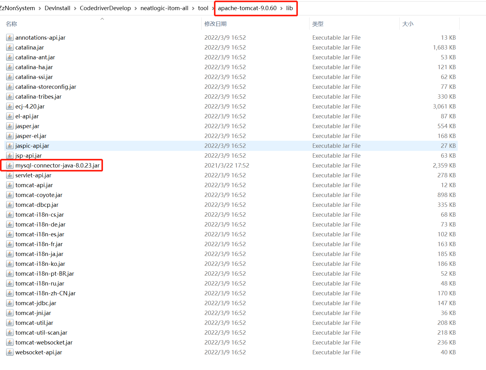

中文 / [English](CODE-BUILD.en.md)

# 研发环境搭建

## 下载项目所有代码
获取代码 签出neatlogic-itom-all可以一次性获取所有模块代码，由于neatlogic-itom-all使用submodule引入模块，签出代码时需加上--recurse-submodules参数。范例：
```
  git clone url --recurse-submodules
```

##  IntelliJ IDEA配置(2022.2.4+)
### 新建workspace,并引入所有项目
> 打开项目

> 选择 neatlogic-webroot 模块打开

> 再添加其他模块


如上图,如果分支模块右侧的git分支号显示不是develop3.0.0则需要在neatlogic-itom-all目录下执行命令
```
git submodule foreach 'git checkout develop3.0.0'
```
### 配置maven(版本3.8+)
> 使用maven自带的setting.xml文件即可，如果存在网络问题，则需要通过私有nexus仓库或者别的方式下载第三方依赖了


### 配置JDK8


### 刷新maven依赖

>如果刷新后提示Could not find artifact 以下商业模块，则是正常的，执行后续步骤即可

### 配置Tomcat9


#### 指定本地Tomcat

#### 将mysql8的jdbc驱动放入Tomcat的lib目录



#### VM Options
```
//nacos配置，会优先使用nacos，获取不到config则会从config.properties中获取
-Dnacos.home=192.168.0.10:8848 
-Dnacos.namespace=lvzk_local 
//日志级别
-Dlog4j.priority=ERROR 
//设为true，输入用户名后可使用任意密码登录，只能在研发阶段使用！
-DenableNoSecret=false
//确保JVM使用UTF-8编码来解释和处理文本数据,否则可能会导致中文乱码
-Dfile.encoding=UTF-8 
```
#### 配置自动构建的时机

### 配置config.properties
nacos的配置文件模板如下，如果不使用nacos，则需要配置在config.properties中：
``` properties
#database properties
db.driverClassName = com.mysql.cj.jdbc.Driver
db.url = jdbc:mysql://localhost:3306/neatlogic?characterEncoding=UTF-8&jdbcCompliantTruncation=false&allowMultiQueries=true&useSSL=false&&serverTimeZone=Asia/Shanghai
db.username = root
db.password = password
db.dataSource.maxTotal=10
 
conn.validationQuery = select 1
conn.testOnBorrow = true
conn.maxActive = 50
conn.initialSize = 4
conn.maxIdle=16
#minio配置，如果不配置，默认使用本地存储
minio.url = http://localhost:8989
minio.accesskey = minioadmin
minio.secretkey = minioadmin
#本地存储起始文件夹，如果调用minio失败，会自动转存到这里，如果需要多服务共享附件，此路径请配置到nas卷上。
data.home = /app/data

#自己的服务地址，主要用于内部跳转
home.url = http://localhost:8099/

#active MQ地址，没有可以不用配
jms.url = tcp://localhost:8161

#心跳设置
heartbeat.rate = 3
heartbeat.threshold = 5

```
#### 将config目录定义为资源目录


### 创建mysql8数据库
#### neatlogic需要使用3个库，字符集采用utf8mb4，排序规则采用utf8mb4_general_ci，由于neatlogic需要动态创建、删除表和视图，请授予数据库连接用户适当的权限。
  + neatlogic：管理库，所用租户共用，用于管理租户信息（租户数据库配置信息等），管理系统的健康状态等。
  + neatlogic_xxx：xxx租户库，xxx租户的数据都保存在这个库。
  + neatlogic_xxx_data：xxx租户的扩展库，用于存放所有由系统自动生成的表和视图。人工构建时需要手动创建这个空库
#### 为了方便理解，以下使用demo租户作为演示。
  1. 请先按照上述说明创建了3个空库neatlogic、neatlogic_demo和neatlogic_demo_data,如下图。
   
  2. 导入样例数据:[neatlogic-database/mysql](../../../neatlogic-database/blob/develop3.0.0/mysql) 将三个sql文件按名字分别导入到三个库。
  3. 修改neatlogic库的datasource表，找到tenant_uuid=demo的那行数据，核对username、password、host和port是否正确配置

### 创建mongodb数据库（如果涉及cmdb配置管理、自动化、巡检和发布模块则需要操作该步骤）
  用于存储自动化作业、采集和巡检等数据。
#### 为了方便理解，一下使用demo租户作业演示
  1. 创建neatlogic_demo空库
  2. 导入定义数据:[neatlogic-database/mongodb](../../../neatlogic-database/blob/develop3.0.0/mongodb/autoexec) ,通过mongostore导入即可
  3. 修改 **mysql** 数据库中的neatlogic_demo库的mongodb表,找到tenant_uuid=demo的那行数据，核对database、username、password、host和option是否正确配置

### 启动Tomcat
如果出现一下日志，说明后端已经启动成功.

> 检查后端服务是否正常
> 浏览器访问 http://localhost:8080/neatlogic/tenant/check/demo
> 

## 前端构建 
[点击查看](../../../neatlogic-web/blob/develop3.0.0/README.md)