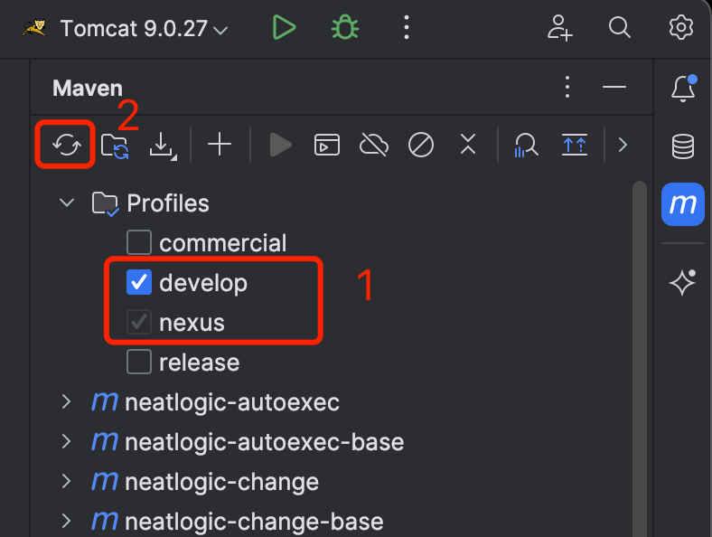
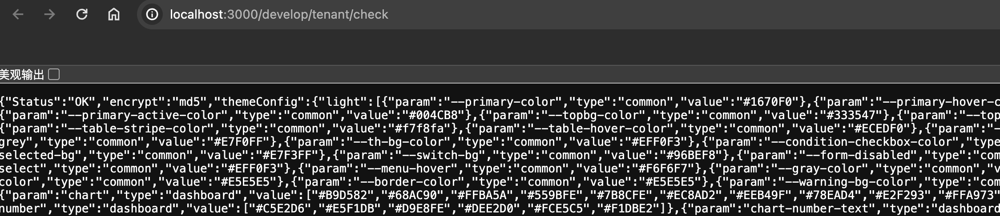
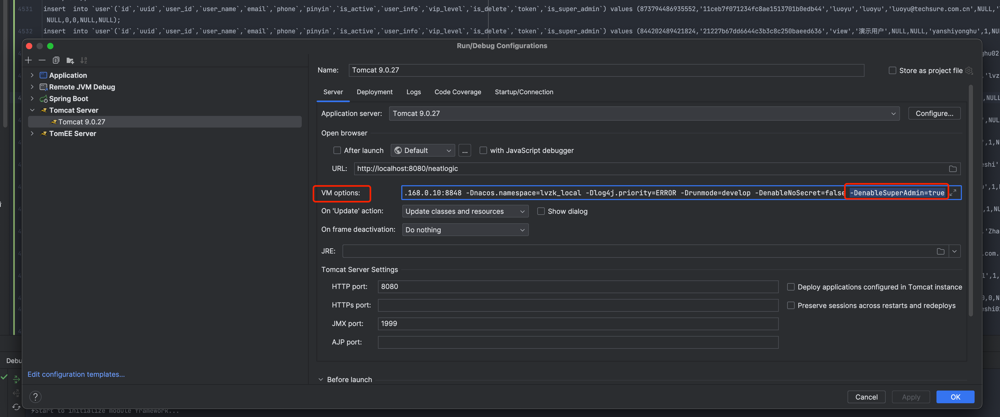

中文 / [English](CODE-BUILD.en.md)

# 构建代码

## 下载项目所有代码
获取代码 签出neatlogic-itom-all可以一次性获取所有模块代码，由于neatlogic-itom-all使用submodule引入模块，签出代码时需加上--recurse-submodules参数。范例：
```
  git clone url --recurse-submodules
```

##  IntelliJ IDEA配置
### 新建workspace,并引入所有项目
> 打开项目

> 选择 neatlogic-webroot 模块打开

> 再添加其他模块


如上图,如果分支模块右侧的git分支号显示不是develop3.0.0则需要在neatlogic-itom-all目录下执行命令
```
git submodule foreach 'git checkout develop3.0.0'
```
### 配置maven


### 配置JDK8


### 刷新maven依赖

### 配置Tomcat9


#### 指定本地Tomcat

#### 将mysql8的jdbc驱动放入Tomcat的lib目录


```
//VM Option
//nacos配置，会优先使用nacos，获取不到config则会从config.properties中获取
-Dnacos.home=192.168.0.10:8848 
-Dnacos.namespace=lvzk_local 
//日志级别
-Dlog4j.priority=ERROR 
-Drunmode=develop 
//设为true，输入用户名后可使用任意密码登录，只能在研发阶段使用！
-DenableNoSecret=false 
//设为true开启运维模式，能用超级管理员身份登录进行紧急干预和授权，此用户权限很大，只能在研发阶段使用！
-DenableSuperAdmin=true
```
#### 配置自动构建的时机

### 配置config.properties
nacos的配置文件模板如下，如果不使用nacos，则需要配置在config.properties中：
``` properties
#database properties
db.driverClassName = com.mysql.cj.jdbc.Driver
db.url = jdbc:mysql://localhost:3306/neatlogic?characterEncoding=UTF-8&jdbcCompliantTruncation=false&allowMultiQueries=true&useSSL=false&&serverTimeZone=Asia/Shanghai
db.username = root
db.password = password
db.dataSource.maxTotal=10
 
conn.validationQuery = select 1
conn.testOnBorrow = true
conn.maxActive = 50
conn.initialSize = 4
conn.maxIdle=16
#minio配置，如果不配置，默认使用本地存储
minio.url = http://localhost:8989
minio.accesskey = minioadmin
minio.secretkey = minioadmin
#本地存储起始文件夹，如果调用minio失败，会自动转存到这里，如果需要多服务共享附件，此路径请配置到nas卷上。
data.home = /app/data

#自己的服务地址，主要用于内部跳转
home.url = http://localhost:8099/

#active MQ地址，没有可以不用配
jms.url = tcp://localhost:8161

#心跳设置
heartbeat.rate = 3
heartbeat.threshold = 5

```
#### 将config目录定义为资源目录


### 创建数据库
#### neatlogic需要使用3个库，字符集采用utf8mb4，排序规则采用utf8mb4_general_ci，由于neatlogic需要动态创建、删除表和视图，请授予数据库连接用户适当的权限。
  + neatlogic：管理库，所用租户共用，用于管理租户信息，管理系统的健康状态等。
  + neatlogic_xxx：xxx租户的主库，租户的核心数据都保存在这个库。
  + neatlogic_xxx_data：xxx租户的扩展库，用于存放所有由系统自动生成的表和视图。人工构建时需要手动创建这个空库
#### 为了方便构建，目前提供了[neatlogic.sql](neatlogic.sql)和[neatlogic_demo.sql](neatlogic_demo.sql)两个SQL文件，请按照上述说明创建了空库再执行脚本，执行完会自动创建demo租户，如果想把demo改成别的名称，需要修改neatlogic库中的tenant表，修改neatlogic_demo的库名为neatlogic_新的租户名称
>注意:还需要修改neatlogic数据库datasource表对应租户的数据库连接信息(password、host、port)


#### 为了更快让系统正常使用,每个模块提供了dml sql文件,用于导入demo数据.如果是xxx_data后缀的sql,则需要到租户data库执行. 如果是不熟悉我们项目的导入所有dml sql,熟悉的用户倒是可以按需执行对应模块的dml sql.

>注意:ddldemo_data.sql 也是需要执行的,里面存放的是租户data库需要的schema,如:矩阵、cmdb的配置项动态表(通过租户库固定的表的数据动态生成租户data库动态表)

#### 初始化创建用户、分组、角色授权
VM options 添加-DenableSuperAdmin=true 参数

配置文件config.properties 增加
```
#超级管理员账号
superadmin = neatlogic
#超级管理员密码
superadmin.password = 123456
VM options 添加-DenableSuperAdmin=true 参数
```
然后启动后使用上面的超级管理员账号 创建用户、角色、分组 授权等操作,好了,再通过创建的用户登录即可
### 启动Tomcat
如果出现一下日志，说明后端已经启动成功.

## 前端构建 
[点击查看](../../../neatlogic-web/blob/develop3.0.0/README.md)