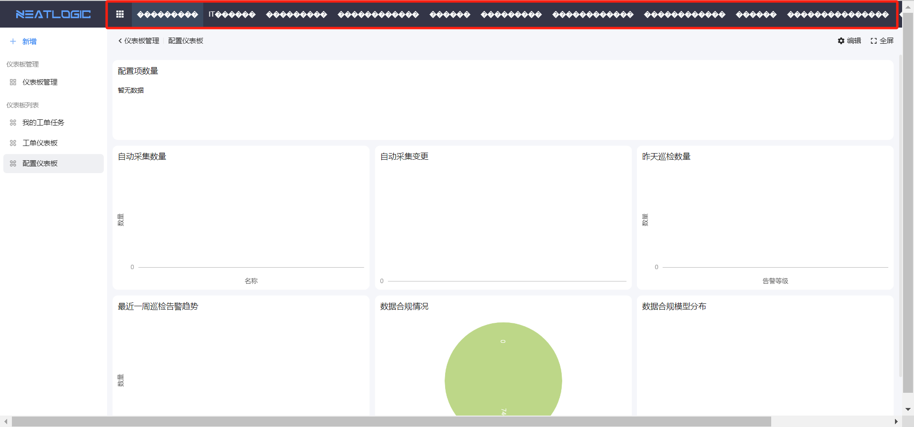
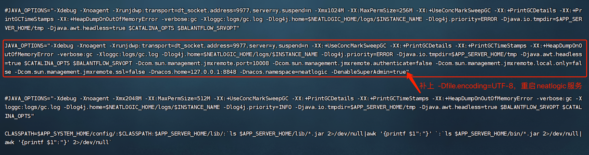

中文 / [English](LOCAL_INSTALL.en.md)

# 本地部署教程
  目的：
  - 降低部署门槛。方便社区用户本地一键部署，极大减少部署工作量
  - 更专注于体验产品使用
  - 部署环境统一，便于定位并解决异常

# ❗❗❗ 注意
```js
 ❗❗❗" 安装包内的服务代码并不是当下最新的 "   
```
 如发现问题:<br>
>请本地研发环境更新最新代码后,再确认是否重现<br>
> **如果无法重现,需自行编译打包到具体服务部署路径替换更新(目前只有neatlogic neatlogic-web neatlogic-runner neatlogic-autoexec-backend 这几个服务需要更新)<br>
> **如果重现,请联系我们,提issue,谢谢!<br>
## 详细步骤（使用root用户执行）
下载一键部署安装包（目前仅开放支持x86架构的系统，建议在centos7环境下安装）
[点击下载](https://pan.baidu.com/s/1WsTvyIKjK-Bfd3kQzQfnZA?pwd=ccct)
```
	1.拷贝安装包到目标机器的“/”根目录（如果条件不满足，在/目录加软连接对应目录，如： ln -s /home/app/app  /app）
	2.解压安装包
		tar -xvf neatlogic_all_install_community_x86_64.tar.gz
	3.进入install目录执行setup.sh脚本
		cd /app/install && sh setup.sh
        4.脚本执行完后，可以chrome浏览器访问http://虚拟机ip:8090/demo 前端页面，账号密码： admin/neatlogic@901
```
如有问题，因为环境问题，可能会有很多原因导致，可以先自己排查一下。
联系我们:
- **企业微信** <br>
<p align="left"></p>


## 服务详细
```js
 📌" deployadmin命令需要切app用户才能执行 "   
```
|  服务名  |  端口  | 访问地址 | 服务启停命令 | 部署路径(更新版本) | 描述 |
| ----  | ----  | ----  | ---- | ---- | ---- | 
| neatlogic | 8282 | - | deployadmin -s neatlogic -a startall/stopall/restartall | /app/systems/neatlogic/apps/neatlogic.war |tomcat后端服务 ,通过http://虚拟机ip:8282/neatlogic/tenant/check/demo 验证服务是否正常 |
| neatlogic-web | 8090 | http://虚拟机ip:8090/demo | service nginx start/stop/restart | /app/systems/neatlogic-web/dist | 前端服务 |
| neatlogic-runner | 8084、tagent心跳端口：8888 | - | deployadmin -s neatlogic-runner -a startall/stopall/restartall | /app/systems/neatlogic-runner/lib/neatlogic-runner.jar |执行器runner后端服务，通过http://虚拟机ip:8084/autoexecrunner/anonymous/api/rest/server/health/check/demo 验证服务是否正常|
| nginx | - | - | service nginx start/stop/restart | /app/systems/nginx/ | - |
| neatlogicdb | 3306 | - | service neatlogicdb start/stop/restart | /app/databases/neatlogicdb | mysql8数据库 |
| collectdb | 27017 | - | service collectdb start/stop/restart | /app/databases/collectdb | mongodb数据库 |
| neatlogic-autoexec-backend | - | - | - | /app/systems/autoexec/ | - |


## FAQ
- 乱码

原因：java_options 缺少-Dfile.encoding=UTF-8，安装包下个版本更新<br>
解决办法：vim /app/systems/neatlogic/sysconfig/serveradmin/neatlogic.env

- deployadmin: command not found
原因：一般客户安装好环境之后 不会给root用户的，所以需要用app用户执行
解决办法：app用户执行或在root用户的.bash_profile PATH加上/app/serveradmin/bin

