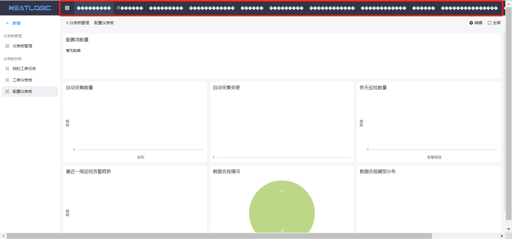
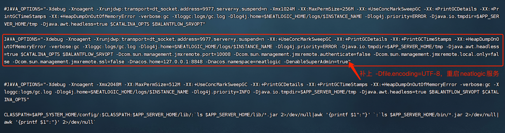
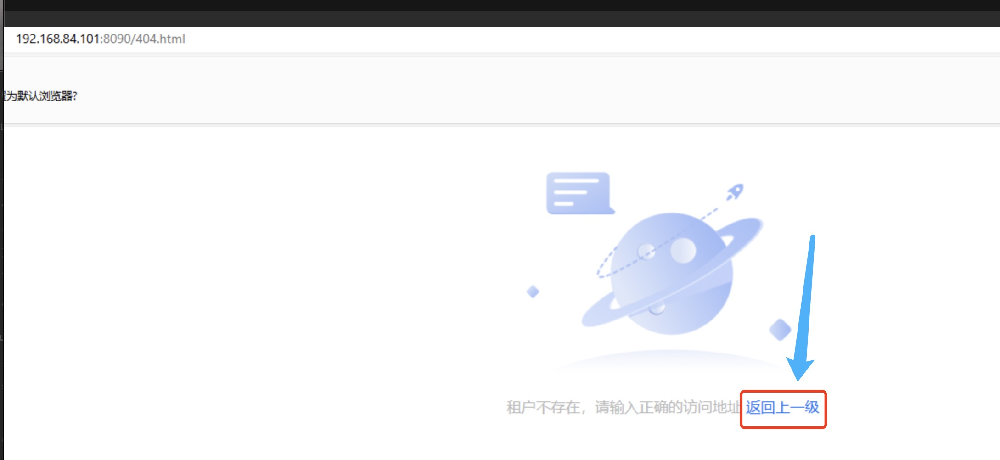
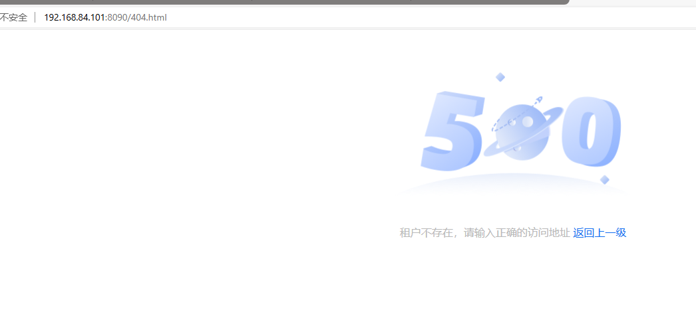

中文 / [English](LOCAL_INSTALL.en.md)

# 本地部署教程
  目的：
  - 降低部署门槛。方便社区用户本地一键部署，极大减少部署工作量
  - 更专注于体验产品使用
  - 部署环境统一，便于定位并解决异常

# ❗❗❗ 注意
```js
 ❗❗❗" 安装包内的服务代码并不是当下最新的，需要重新构建更新包后，点击neatlogic系统右上角“问号”图标的帮助文档才能正常显示使用"   
 ❗❗❗" 目前仅支持 x86 架构，并在 CentOS 7 环境下提供安装支持。若使用其他系统版本，需针对 Python、MongoDB 等组件进行重新编译，以生成与目标系统兼容的安装介质。"
```
 如发现问题:<br>
>请本地研发环境更新最新代码后,再确认是否重现<br>
> **如果无法重现,需自行编译打包到具体服务部署路径（查看本文“服务详细”有介绍）替换更新,目前只有<br>
> neatlogic ： <a href="https://gitee.com/neat-logic/neatlogic-itom-all/blob/develop3.0.0/WAR_INSTALL.md">打包教程,点此查看</a>，停止服务，并删除/app/systems/neatlogic/apps下面的所有文件后，将新的war包copy过来，重启服务即可<br>
> neatlogic-web ： <a href="https://gitee.com/neat-logic/neatlogic-web/blob/develop3.0.0/README.md">打包教程,点此查看</a> ，删除/app/systems/neatlogic-web/dist目录，将新的dist目录copy过来即可<br>
> neatlogic-runner ：添加neatlogic-tagent-client.jar（在模块根目录下有这个jar）到私有的nexus仓库或手动导入jar到本地maven库后，修改pom文件中这个jar依赖的版本，再install出jar替换重启服务即可：<br>
> ```
> #如需手动导入jar到本地maven库
> mvn install:install-file -Dfile=neatlogic-tagent-client.jar -DgroupId=com.neatlogic -DartifactId=tagent -Dversion=1.2.2.2 -Dpackaging=jar
> ```
> ```
> #pom补充修改配置
> <dependency>
> 	<groupId>com.neatlogic</groupId>
> 	<artifactId>tagent</artifactId>
> 	<version>1.2.2.2</version>
> </dependency>
> ```
> neatlogic-autoexec-backend ：纯脚本，直接替换文件即可（git上面这个项目的所有文件都要覆盖，其它不存在的文件保留不要动）<br>
> 这几个服务需要更新<br>
> **如果重现,请联系我们,提issue,谢谢!<br>
## 详细步骤（使用root用户执行）
下载一键部署安装包（目前仅支持 x86 架构，并在 CentOS 7 环境下提供安装支持。若使用其他系统版本，需针对 Python、MongoDB 等组件进行重新编译，以生成与目标系统兼容的安装介质。）
[点击下载](https://t2.znas.cn/iNW6s2Xvsve)
```
	1.拷贝安装包到目标机器的“/”根目录（如果条件不满足，在/目录加软连接对应目录，如： ln -s /home/app/app  /app）
	2.解压安装包
		tar -xvf neatlogic_all_install_community_x86_64.tar.gz
	3.进入install目录执行setup.sh脚本
		cd /app/install && sh setup.sh
        4.脚本执行完后，可以chrome浏览器访问http://虚拟机ip:8090/demo 前端页面，账号密码： admin/neatlogic@901
```
如有问题，因为环境问题，可能会有很多原因导致，可以先自己排查一下。
联系我们:
- **企业微信** <br>
<p align="left"></p>


## 服务详细
```js
 📌" deployadmin命令需要切app用户才能执行 "   
```
|  服务名  |  端口  | 访问地址 | 服务启停命令 | 部署路径(更新版本) | 配置文件路径 | 描述 |
| ----  | ----  | ----  | ---- | ---- | ---- | ---- |
| neatlogic | 8282 | - | deployadmin -s neatlogic -a startall/stopall/restartall | /app/systems/neatlogic/apps/neatlogic.war | /app/systems/neatlogic/config/ |tomcat后端服务 ,通过http://后端虚拟机ip:8282/neatlogic/tenant/check/demo 验证服务是否正常 |
| neatlogic-web | 8090 | http://虚拟机ip:8090/demo | service nginx start/stop/restart | /app/systems/neatlogic-web/dist | - | 前端服务 |
| neatlogic-runner | 8084、tagent心跳端口：8888 | - | deployadmin -s neatlogic-runner -a startall/stopall/restartall | /app/systems/neatlogic-runner/lib/neatlogic-runner.jar | /app/systems/neatlogic-runner/config |执行器runner后端服务，通过http://虚拟机ip:8084/autoexecrunner/anonymous/api/rest/server/health/check/demo 验证服务是否正常|
| nginx | - | - | service nginx start/stop/restart | /app/systems/nginx/ | /app/systems/nginx/conf | - |
| neatlogicdb | 3306 | - | service neatlogicdb start/stop/restart | /app/databases/neatlogicdb | /app/databases/neatlogicdb/conf | mysql8数据库 , client连接通过命令： /app/databases/neatlogicdb/mysql/bin/mysql -uroot -p'neatlogic@901' --socket=/app/databases/neatlogicdb/data/mysql.sock |
| collectdb | 27017 | - | service collectdb start/stop/restart | /app/databases/collectdb | /app/databases/collectdb/conf | mongodb数据库 |
| neatlogic-autoexec-backend | - | - | - |  /app/systems/autoexec/ | /app/systems/autoexec/conf | - |


## FAQ
### 乱码

 **原因** ：java_options 缺少-Dfile.encoding=UTF-8，安装包下个版本更新<br>
 **解决办法** ：vim /app/systems/neatlogic/sysconfig/serveradmin/neatlogic.env

### deployadmin: command not found<br>
 **原因** ：一般客户安装好环境之后 不会给root用户的，所以需要用app用户执行<br>
 **解决办法** ：app用户执行或在root用户的.bash_profile PATH加上/app/serveradmin/bin<br>
### 页面提示租户不存在


 **原因** ： 后端服务没启动或有异常导致启动失败<br>
 **解决办法** ：停止服务 deployadmin -s neatlogic -a stopall,再启动服务 deployadmin -s neatlogic -a startall
观察日志没有异常，成功启动服务后（INFO: [xxxxx]毫秒后服务器启动）。<br>
如果前后端服务不在一个服务器上则在前端的服务器curl一下
```
http://后端虚拟机ip:8282/neatlogic/tenant/check/demo
```
确保前端服务器和后端服务器网络是正常的。<br>
如果前后端服务在同一个服务器上则在浏览器上访问下
```
http://后端虚拟机ip:8282/neatlogic/tenant/check/demo
```
看能否正常返回数据,类似如下：
```
{"Status":"OK","encrypt":"md5","themeConfig":{},"mobileFileDownloadEnabled":"0","commercialModuleSet":["pbc","process","cmdb","tenant"]}
```
说明tomcat后端服务正常启动了,然后重新在浏览器访问http://虚拟机ip:8090/demo<br>
### tagent注册 This MongoDB deployment does not support retryable writes. Please add retryWrites=false to your connection string
**原因** ：事务需要开启副本集支持<br>
**解决办法** ：开启副本集
1. 修改 mongodb.conf，放开 replSet=autoexec-rs
2. 重启mongodb 
3. 进入MongoDB终端
```
/app/databases/collectdb/bin/mongo --host 127.0.0.1 --port 27017 -u admin -p u1OPgeInMhxsNkNl
```
4. 在MongoDB命令行模式下，修改127.0.0.1 为本机的真实IP（否则别的runner连不上MongoDB）
```
cfg = rs.conf()
cfg.members[0].host = "实际IP:端口号"  // 例如："192.168.1.100:27017"
rs.reconfig(cfg, {force: true})
```
5. 继续输入rs.conf()，查看副本集的最新配置， 若members里面已经改成了真实的IP，则已经生效。
