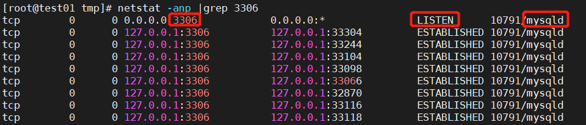

# 项目部署教程

## Docker环境检查

检查docker版本(返回版本信息，说明docker已安装)
```
docker --version
docker-compose --version
```
> 注意:请确保docker已安装,才能进行后续步骤
## 安装
```
curl https://gitee.com/neat-logic/neatlogic-itom-all/raw/develop3.0.0/neatlogic_install.sh|bash
```
为了解决可能存在操作系统层面端口冲突,需自定义容器暴露到操作系统端口:
| 参数名 | 默认端口 | 描述 |
|---|---|---|
| dbPort | 3306  | neatlogic mysql端口  |
| collectdbPort | 27017 | neatlogic mongodb端口   |
| runnerPort | 8084 | runner 服务端口 |
| runnerHeatbeatPort | 8888 | 处理器心跳端口 |
| webPort | 8090 |  前端页面服务端口 |
| masterWebPort | 9099 | 租户管理页面服务端口 |
| mobileWebPort | 8091 | 移动端前端页面服务端口 |
| appPort | 8282 | 后端服务端口 |

例如:需要替换 mobileWebPort 为8092:
```
curl https://gitee.com/neat-logic/neatlogic-itom-all/raw/develop3.0.0/neatlogic_install.sh|bash
```

## 卸载
```
curl https://gitee.com/neat-logic/neatlogic-itom-all/raw/develop3.0.0/neatlogic_clear.sh|bash
```
## 镜像容器服务说明
|  启动顺序  |  容器服务名  |  暴露到操作系统层面端口  | 容器内服务启停命令  |
|  ----  | ----  | ----  | ----  |
|  1  |  neatlogicdb  |  3306端口  |  启： /app/databases/neatlogicdb/scripts/neatlogicdb start<br>停： /app/databases/neatlogicdb/scripts/neatlogicdb stop  |
|  1  |  neatlogic-collectdb  |  27017端口  |  启：/app/databases/collectdb/bin/mongod --config /app/databases/collectdb/conf/mongodb.conf<br>停：<br>mongo 127.0.0.1:27017/admin -uadmin -p u1OPgeInMhxsNkNl << EOF<br>db.shutdownServer();<br>exit;<br>EOF  |
|  2  |  neatlogic-runner  |  8084、8888端口  |  启：deployadmin -s autoexec-runner -a startall<br>停：deployadmin -s autoexec-runner -a stopall  |
|  2  |  neatlogic-app  |  8282端口  | 启：deployadmin -s neatlogic -a startall<br>停：deployadmin -s neatlogic -a stopall |
|  3  |  neatlogic-web  |  8090端口  | 启：/app/systems/nginx/sbin/nginx<br>重启：/app/systems/nginx/sbin/nginx -s reload <br>停：kill xx |


> 说明：启动顺序： 数字越小，启停优先级越高 1 > 2 >3

## 常见问题

1. 拉取镜像时docker未启动<br>
报错信息```Cannot connect to the Docker daemon at unix:///var/run/docker.sock. Is the docker daemon running?```<br>
说明docker未启动，启动docker后再重新执行部署文件即可。
2. 重新拉取镜像前未卸载服务，导致服务、容器被占用<br>
出现报错信息```Error response from daemon: network with name neatlogic already exists```，说明服务neatlogic已在运行，需停止服务。<br>
出现报错信息```docker: Error response from daemon: Conflict, The container name "/neatlogic-xxx" is already in use by container "xxxxxxxx". You have to remove (or rename) that container to be able to reuse that name.```，说明存在与/neatlogic-xxx同名的容器，需停止容器并删除容器和相关镜像。
3. 服务端口被占用<br>
执行下面命令可以查看端口占用情况<br>
```
netstat -anp |grep XX  #XX是端口号
```
如图，如果有LISTEN那一行，就表示端口被占用。此处注意，图中显示的LISTENING并不表示端口被占用，不要和LISTEN混淆哦，查看具体端口时候，必须要看到tcp、端口号、LISTEN那一行，才表示端口被占用了<br>
<br>
端口被占用时，可以先查询该端口指定程序的进程号，然后使用命令关闭使用该端口号运行的程序
```
ps -ef |grep XX  #查询该端口指定程序的进程号命令，XX是端口号
kill -9 XX  #关闭进程，XX是进程号
```
4.docker重启后，容器中的进程挂了

## 常用操作命令说明

**1、部署，docker run -it --name 容器名称  -p 操作系统端口:容器端口 --net 网络名称 -d  镜像:版本**<br>
```
docker run -it --name neatlogic -p 8282:8282 --net neatlogic  -d neatlogic/neatlogic:3.0.0
```

**2、进入容器内部，docker exec -it  [容器名称|容器ID]  /bin/sh**<br>
```
docker exec -it neatlogic /bin/sh
```

**3、查看容器日志，docker logs [容器名称|容器ID]**<br>
```
docker logs neatlogic
```

**4、容器启停，docker  start/stop  [容器名称|容器ID]**<br>
```
docker start/stop  neatlogic-web
```

**5、删除容器，docker rm  [容器名称|容器ID]**<br>
```
docker rm neatlogic
```

**6、删除镜像，docker rm  [镜像ID|镜像名称：版本]**<br>
```
docker rmi -f  neatlogic/neatlogic:3.0.0
```

**7、容器网络：**<br>
```
docker network ls   #查看所有
docker network create  xxxx   #创建网络，默认是桥接**
```

**8、查看正在运行的容器：**<br>
```
docker ps   #查看所有正在运行的容器
```

**9、添加文件执行权限：**<br>
```
chmod +x XXX.sh  #添加执行权限
```

**10、执行脚本：**<br>
```
sh XXX.sh  #执行XXX.sh文件的脚本
```