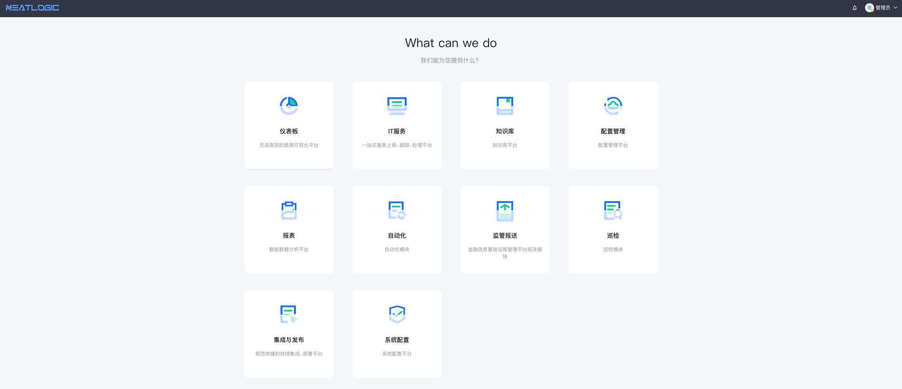
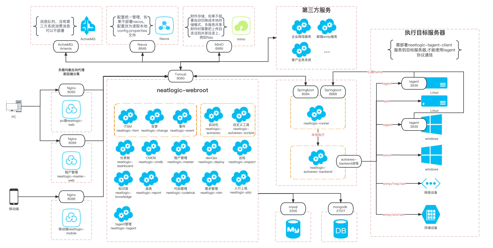

[中文](README.md) / English

## About
NeatLogic is a progressive ITOM platform dedicated to providing ITOM solutions for users of different types and sizes. In addition to the open source version, we also provide secondary development, consulting and other services for enterprise customers. For inquiries, please contact <a href="mailto:zhangzm@neatlogic.com">zhangzm@neatlogic.com</a>,or contact us from <a target="_blank" href="https://join.slack.com/t/neatlogichome/shared_invite/zt-1w037axf8-r_i2y4pPQ1Z8FxOkAbb64w">Slack</a>.

NeatLogic natively supports multi-tenancy (middleware sharing, database sub-tenant mode), modular expansion, already includes key core functions such as process engine, form engine, report engine, large screen, dashboard, etc., functions sensitive to data scale, such as CMDB Fully considered in the design, taking into account the performance requirements of reports and daily use. When only basic functions are used, only Tomcat, Nginx, and Mysql8+ are required, and some advanced functions, such as automatic collection, require MongoDb. \
NeatLogic provides docker image deployment mode and installation package deployment mode. It comes with all databases and middleware. All key services are encapsulated with start and stop commands. Middleware, software packages and configuration files are separated to facilitate users' daily maintenance.

## Runtime
Operating system: Linux, java version: 8+, process memory: 4G or more, 8G is recommended.

## Dependencies

|Component|Version|Necessary|Description|
|---|---|---|---|
|[Tomcat](https://tomcat.apache.org/)|9.0.75|✅|Servlet Container|
|[Mysql](https://www.mysql.com/)|8.0.27|✅|Database|
|[Nginx](https://www.nginx-cn.net/)|1.16.1|✅|Front-end Server|
|[MongoDb](https://www.mongodb.com/)|4.4.3|✖️|Temporary database for automatic collection. Required if using the CMDB auto-collection feature|
|[MinIO](https://www.minio.org.cn/)|5.0.6(2020-05-08T02:40:49Z)|✖️|Attachment storage. If not deployed, it will automatically switch to local storage mode. When sharing attachments among multiple services, the upload directory needs to be set to a shared directory, such as Nas|
|[Nacos](https://nacos.io/zh-cn/)|2.1.0|✖️|Unified configuration management. If Nacos is not deployed, the configuration will be read from the local config.properties file|
|[ActiveMQ Artemis](https://activemq.apache.org/components/artemis/)|2.17.0|✖️|Message queue. If there are no third-party systems consuming messages, it does not need to be deployed|

## Project Structure
NeatLogic adopts a modular approach to code management.

- 🌎 neatlogic-itom-all allows users to obtain all the code at once.
- neatlogic-parent is used to manage the global pom file and all common third-party package references.
- neatlogic-webroot is used to generate war packages and manage submodule references. The pom file can be modified as needed to load different submodules to generate the final war package.
- neatlogic-framework is the base module. All submodules need to reference neatlogic-framework, and the beans of neatlogic-framework can be woven into all submodules.
- neatlogic-tenant is the API part of the basic functionality beans, and is not visible to other submodules.
- neatlogic-web is the front-end code.
- ❌【Temporarily Not Open Source】neatlogic-master is the backend code of the tenant management module, used to manage the tenant information of neatlogic.
- ❌【Temporarily Not Open Source】neatlogic-master-web is the front-end code of the tenant management module, and needs to be deployed separately from neatlogic-web during deployment.
- Each other functional module needs to be split into two code modules, namely neatlogic-xxx and neatlogic-xxx-base. Due to the cross-reference limitation of maven, neatlogic-xxx-base is mainly used to be referenced by other modules, mainly containing pojo and some underlying interfaces. neatlogic-xxx needs to reference neatlogic-xxx-base, mainly containing its own exclusive business beans.

## Service Architecture

## Internal Plugins
To enhance the efficiency of research and development, we have developed the following IDE plugins to assist in development.
- 🚀 [i18nhelper-idea](../../../i18nhelper-idea/blob/main/README.en.md) is used for automatic replacement of i18n key-value pairs and text translation, exclusively for IntelliJ IDEA. The internationalization of neatlogic's backend did not adopt the official properties format solution of spring 5, but switched to the json format solution consistent with the frontend.
- 🚀 [i18nhelper-vscode](../../../i18nhelper-vscode/blob/main/README.en.md) is used for automatic replacement of i18n key-value pairs and text translation, exclusively for vscode.

## About Branch
- 📌 develop x.x.x: Development branch, has not been deployed and finalized in key customers yet. The main features are basically stable, and new features are continuously being added. Some features may be adjusted but will not affect usage.
- 📌 release x.x.x: Release branch, has been deployed and finalized in key customers. Core features will not be largely adjusted, only functional adjustments and defect fixes will be made.
- 🏁 (tag) x.x.x: Each version adjustment of release will be tagged correspondingly, usually after feature adjustments or major defect fixes.

## About Version

Neatlogic has divided the version numbers into two ranges for the development and release branches. The development branch uses the interval [0, 1), while the release branch uses the interval [1, ∞). This is done to ensure that using version ranges to associate modules does not result in version conflicts.

- 🔢 Develop branch version numbers start with 0, such as 0.3.1.0-SNAPSHOT.
- 🔢 After the release branch is frozen, the release branch version number removes the leading 0. and the trailing -SNAPSHOT, resulting in a version number like 3.1.0. For defect fixes, the third digit is incremented, for example, 3.1.1. For feature improvements, the second digit is incremented, such as 3.2.0.

## About Maven Profile

Neatlogic manages different branch version numbers and module dependencies for the community edition and commercial edition using Maven profiles.

- 📇 `develop` is the profile for the development branch. If you are currently on the development branch, select this profile. All dependency package versions end with `-SNAPSHOT`.
- 📇 `release` is the profile for the release branch. If you are currently on the release branch, select this profile. All dependency packages have official version numbers.
- 📇 `commercial` is the profile specifically for the commercial edition. If you are using the community edition for further development, do not select this profile to avoid depending on any commercial edition modules.

    __❗ Note:__ You can choose either `develop` or `release`, but you can select `commercial` along with `develop` or `release`.

## Feature List

### ⭐️ Basic Functions
<table><tr><td>Number</td><td>Category</td><td>Feature</td><td>Description</td></tr><tr><td>1</td><td rowspan="11">Basic</td><td rowspan="5">System Architecture</td><td>The platform adopts a decoupled architecture between the front end and back end, with a pure B/S architecture that does not require the installation of any plugins. It supports access through common browsers via HTTP/HTTPS.</td></tr><tr><td>2</td><td>Supports high availability and distributed deployment of front-end interfaces, back-end services, and execution nodes.</td></tr><tr><td>3</td><td>The platform consists of underlying frameworks and various functional modules. The underlying framework uniformly schedules and loads functional modules, forming a complete ITOM solution.</td></tr><tr><td>4</td><td>The platform has the ability to configure common functional extensions, such as IT service management processes, forms, data matrices, and other features.</td></tr><tr><td>5</td><td>The platform adopts a modular architecture, allowing custom modules to be delivered to meet customer-specific or customized requirements. Users can perform secondary development based on custom modules, including adding modules, adding process components, and interface functions.</td></tr><tr><td>6</td><td rowspan="2">User, Organization, and Role Management</td><td>Supports user, organization, and role management operations such as addition, deletion, modification, and search. It also defines the relationships between users and groups, users and roles, and role and organization permissions.</td></tr><tr><td>7</td><td>No restriction on the organizational hierarchy, supports different levels, group leadership, and position settings.</td></tr><tr><td>8</td><td>Function Permission Management</td><td>Supports assigning function permissions to roles, individuals, and organizational structures, restricting user access and operations.</td></tr><tr><td>9</td><td>Service Windows</td><td>Supports multi-dimensional service window definition, including working days and working time periods.</td></tr><tr><td>10</td><td>Log Audit</td><td>All management operations on the platform are recorded in an audit log, which allows tracing based on the operation object and time.</td></tr><tr><td>11</td><td>Quick Paste</td><td>Supports quick pasting within the platform's rich text box for user convenience.</td></tr><tr><td>12</td><td rowspan="6">Dashboard</td><td rowspan="6">Dashboard Management</td><td>Supports user-defined dashboard data panels at the system level and personal level.</td></tr><tr><td>13</td><td>Supports adding, modifying, deleting, copying, importing, and exporting dashboards.</td></tr><tr><td>14</td><td>Dashboards support common presentation components such as text, data, tables, pie charts, radar charts, bar charts, line charts, area charts, gauges, stacked charts, scatter plots, and heat maps.</td></tr><tr><td>15</td><td>Dashboards support quick data presentation based on selected presentation components and their corresponding data sources through configuration.</td></tr><tr><td>16</td><td>Dashboards support user drag-and-drop layout.</td></tr><tr><td>17</td><td>System-level dashboards can be authorized to users, roles, and organizational structures. Authorized users can view corresponding system-level dashboards.</td></tr><tr><td>18</td><td rowspan="7">Data Source</td><td rowspan="7">Data Matrix</td><td>Supports user-defined data matrix addition, deletion, modification, search, import, and export management.</td></tr><tr><td>19</td><td>Supports user-defined static data sources with custom headers and configured data. They can be used as data sources for dropdown boxes, table selectors, and other components in forms and reports.</td></tr><tr><td>20</td><td>Supports user-configured interface for querying third-party data, which can be used as data sources for dropdown boxes, table selectors, and other components in forms and reports.</td></tr><tr><td>21</td><td>Supports user-configured CMDB view data in this system, which can be used as data sources for dropdown boxes, table selectors, and other components in forms and reports.</td></tr><tr><td>22</td><td>Supports user-configured SQL and the creation of query views to query data from all data tables in the system. It can be used as data sources for dropdown boxes, table selectors, and other components in forms and reports.</td></tr><tr><td>23</td><td>Existing matrices can be copied to create new matrices that are similar to the original ones.</td></tr><tr><td>24</td><td>Matrices support export and import, which can be used for matrix migration between different environments.</td></tr><tr><td>25</td><td rowspan="7">Data Warehouse</td><td rowspan="7">Data Warehouse</td><td>Supports user-defined data warehouse addition, deletion, modification, search, import, and export management.</td></tr><tr><td>26</td><td>Supports converting basic process data tables into higher-level management objects for statistics in the user-defined data warehouse.</td></tr><tr><td>27</td><td>Supports user-defined data sources for the data warehouse.</td></tr><tr><td>28</td><td>Supports user-defined data objects and filter conditions for the data warehouse.</td></tr><tr><td>29</td><td>Supports user-defined data modes for the data warehouse, such as full replacement or incremental append.</td></tr><tr><td>30</td><td>Supports user-defined manual data synchronization and scheduled data synchronization for the data warehouse.</td></tr><tr><td>31</td><td>User-defined data sources can be used in consumption scenarios such as big screens, dashboards, and reports.</td></tr><tr><td>32</td><td rowspan="8">Integration</td><td rowspan="3">Interface Integration</td><td>Supports user-defined integration configuration and management for internal or external REST interfaces, including submission methods, authentication methods, parameter output format conversion, and parameter input format conversion.</td></tr><tr><td>33</td><td>Supports online help dictionaries for input and output parameters of integrated interfaces, and allows direct online interface invocation and testing.</td></tr><tr><td>34</td><td>Supports import, export, and call record auditing of integration interface lists.</td></tr><tr><td>35</td><td rowspan="2">Message Subscription</td><td>Supports subscribing or unsubscribing to messages based on message types.</td></tr><tr><td>36</td><td>Supports temporary and persistent subscriptions for message types.</td></tr><tr><td>37</td><td rowspan="3">Interface Management</td><td>The platform adopts a decoupled architecture between the front end and back end, with data interaction based on standard REST interfaces. Interfaces are divided into internal and external interfaces. The interface management allows viewing of interface parameters, output parameters, help information, authentication methods, and other details.</td></tr><tr><td>38</td><td>Interfaces support enabling or disabling call records to prevent storage space wastage caused by high-frequency interface calls.</td></tr><tr><td>39</td><td>Supports configuring multiple instances for external interfaces, as well as authentication methods, authentication users, authentication passwords, and validity periods.</td></tr><tr><td>40</td><td rowspan="11">Reports</td><td rowspan="6">Report Templates</td><td>Supports adding, copying, importing, and exporting report templates.</td></tr><tr><td>41</td><td>Supports user-defined display interfaces, filter conditions, and data source configurations for report templates.</td></tr><tr><td>42</td><td>Report conditions support common HTML components, such as text boxes, dropdown boxes, multi-select, radio buttons, date pickers, and other controls, as well as binding control data source settings.</td></tr><tr><td>43</td><td>Report presentation supports common components such as tables, line charts, pie charts, bar charts, and other commonly used controls.</td></tr><tr><td>44</td><td>Report data sources support standard TSQL statements and REST interfaces.</td></tr><tr><td>45</td><td>Supports configuring access permissions for reports.</td></tr><tr><td>46</td><td rowspan="5">Report Management</td><td>Supports quickly generating management reports with different dimensions based on templates.</td></tr><tr><td>47</td><td>Supports dividing reports based on permissions, where different users with different permissions can see different reports.</td></tr><tr><td>48</td><td>Supports online real-time modification and update of report configurations without restarting the application service.</td></tr><tr><td>49</td><td>Supports report export in formats such as Word, Excel, and PDF.</td></tr><tr><td>50</td><td>Supports configuring scheduled report sending strategies.</td></tr></table>

### ⭐️ ITSM
<table><tr><td>Number</td><td>Category</td><td>Feature</td><td>Description</td></tr><tr><td>1</td><td rowspan="13">Process</td><td rowspan="2">Process Components</td><td>Automatically loads process components based on the modules loaded on the platform, such as event, problem, change, release, automation, custom release, interface invocation components, etc.</td></tr><tr><td>2</td><td>Supports user-defined process components for secondary development, such as approval in the OA system, bastion machine authorization, etc.</td></tr><tr><td>3</td><td rowspan="11">Process Management</td><td>Supports user-defined operation and maintenance service process, supports graphical drag-and-drop layout design.</td></tr><tr><td>4</td><td>Supports process export and import for migration between different environments.</td></tr><tr><td>5</td><td>Supports copying existing processes to create new processes similar to the original ones.</td></tr><tr><td>6</td><td>Supports parallel, serial, and conditional nodes in processes, can be used for convergence, diversion, and rollback of process flows.</td></tr><tr><td>7</td><td>Nodes in processes support automatic start processing and automatic flow setting.</td></tr><tr><td>8</td><td>Processes support user-defined personalized forms and can hide or disable certain form data in different process steps.</td></tr><tr><td>9</td><td>Process steps support user-defined personalized actions, such as reminders, cancellations, modifications to reported content, etc.</td></tr><tr><td>10</td><td>Process steps support user-defined notification strategies, notification actions, and notification content.</td></tr><tr><td>11</td><td>Process steps support user-defined external call actions for step changes, allowing real-time synchronization to third-party systems.</td></tr><tr><td>12</td><td>Processes provide automatic processing nodes for calling third-party interfaces in orchestration.</td></tr><tr><td>13</td><td>Processes provide automation nodes and CMDB nodes to achieve closed-loop of platform product data and scenarios.</td></tr><tr><td>14</td><td rowspan="9">Form</td><td rowspan="9">Form Management</td><td>Supports user-defined forms, supports drag-and-drop form layout.</td></tr><tr><td>15</td><td>Provides rich components, including text, rich text, time, password, dropdown, cascading dropdown, dropdown tree, hyperlink, attachment upload, user selector, table selector, table input, etc.</td></tr><tr><td>16</td><td>Supports different view and edit permissions for the same form on different process nodes.</td></tr><tr><td>17</td><td>Supports data linkage in forms, such as automatically performing display, hide, disable, assignment, filtering, etc., on another control B when the value of control A changes.</td></tr><tr><td>18</td><td>During form design, supports preview.</td></tr><tr><td>19</td><td>Supports tabular layout for forms, supports operations such as merging rows and columns.</td></tr><tr><td>20</td><td>Supports form version management, can quickly switch to the specified version, and supports recording version information.</td></tr><tr><td>21</td><td>Supports copying existing forms to create new forms similar to the original ones.</td></tr><tr><td>22</td><td>Forms support export and import for form migration between different environments.</td></tr><tr><td>23</td><td rowspan="11">Service Catalog</td><td rowspan="3">Service Types</td><td>Supports user addition, modification, and deletion of service types.</td></tr><tr><td>24</td><td>Supports common service type definitions, such as event, problem, change, release, etc.</td></tr><tr><td>25</td><td>Supports custom display colors and work order sequence generation rules for different service types, such as type + year + month + day + the number of work orders of the same type on that day.</td></tr><tr><td>26</td><td rowspan="2">Service Catalog</td><td>Supports user addition, modification, and deletion of service catalogs.</td></tr><tr><td>27</td><td>Supports unlimited levels of service catalogs, supports service catalog permissions setting, and custom reporting help for service catalogs.</td></tr><tr><td>28</td><td rowspan="6">Service Channels</td><td>Supports user addition, modification, and deletion of service channels.</td></tr><tr><td>29</td><td>Multiple service channels can correspond to one management service process.</td></tr><tr><td>30</td><td>Supports service channel priority, service types, service windows, service scope (permissions), service channel help, and other configurations.</td></tr><tr><td>31</td><td>Supports specifying whether a service channel supports mobile use.</td></tr><tr><td>32</td><td>Supports dynamic matching of SLA policies based on service channels, service windows, and priorities.</td></tr><tr><td>33</td><td>Supports quick search and bookmarking of service channels.</td></tr><tr><td>34</td><td rowspan="5">Work Order Panel</td><td rowspan="5">Work Order Center</td><td>Supports custom personal to-do classifications from the user's perspective, such as "reported by me," "waiting for my handling," "waiting for my group to handle," "work orders I am involved in," etc.</td></tr><tr><td>35</td><td>Configures work order view permissions based on work order types.</td></tr><tr><td>36</td><td>Supports displaying work order data in card and list views, with red timeout indication for overdue work orders.</td></tr><tr><td>37</td><td>Supports simple query conditions and complex combination query retrieval of work orders.</td></tr><tr><td>38</td><td>Users can create personal work order categories based on conditions such as reporter, processor, reporting channel, and whether it is overdue, and generate fixed menus in the work order center.</td></tr><tr><td>39</td><td rowspan="5">Task Assignment</td><td rowspan="3">Manual Assignment</td><td>Supports assignment to individuals,organizations, roles, stakeholders (such as reporters, recipients) by designated personnel or the service desk.</td></tr><tr><td>40</td><td>Supports manual intervention by users with appropriate permissions to reassign the handler, group, or role of work orders.</td></tr><tr><td>41</td><td>Supports downstream node handlers specified by previous step handlers.</td></tr><tr><td>42</td><td rowspan="2">Automatic Assignment</td><td>Supports dynamic assignment of handlers, groups, and roles based on form values.</td></tr><tr><td>43</td><td>Supports complex dispatchers for dynamic assignment of handlers, such as average distribution based on workload, assignment to the department leader of the reporter, etc.</td></tr><tr><td>44</td><td rowspan="3">User Reporting</td><td rowspan="3">Service Reporting</td><td>Supports users to quickly initiate fault reporting through PC or mobile devices.</td></tr><tr><td>45</td><td>Supports batch reporting by users with appropriate permissions through file import, for subsequent supplementary work order creation.</td></tr><tr><td>46</td><td>Supports users with appropriate permissions or service desk personnel to initiate problem reporting on behalf of others.</td></tr><tr><td>47</td><td rowspan="8">Work Order Handling</td><td rowspan="8">Work Order Processing</td><td>Supports work order flow, rejection, cancellation, and management intervention operations.</td></tr><tr><td>48</td><td>Supports operation audit of work order reporting, processing, and activity logs.</td></tr><tr><td>49</td><td>Supports transfer, request for assistance, and consultation operations during work order processing.</td></tr><tr><td>50</td><td>Supports synchronization of work order content to the knowledge base, generating knowledge base documents.</td></tr><tr><td>51</td><td>Supports association and transfer of work orders to other service work orders during processing.</td></tr><tr><td>52</td><td>Supports recording operation logs of work order lifecycles, including all changes in the lifecycle such as form modification, reply, attachment upload, work order flow, rollback, etc.</td></tr><tr><td>53</td><td>Supports viewing work order process diagrams and global work order progress.</td></tr><tr><td>54</td><td>Handler perspective supports the workbench mode, allowing quick switching between multiple pending tasks of the current user.</td></tr><tr><td>55</td><td rowspan="5">Timeliness</td><td rowspan="5">SLA Timeliness</td><td>Supports precise timing strategies for work orders, calculating timeliness based on work order units.</td></tr><tr><td>56</td><td>Supports timing strategies at the node level, calculating timeliness based on single nodes or multiple nodes.</td></tr><tr><td>57</td><td>Supports dynamic timeliness settings based on priorities, impact scopes, whether the reporter is a VIP, etc.</td></tr><tr><td>58</td><td>Supports timeout or near-term notification, with configurable automatic notifications at specific time points, such as notifications before N minutes or after N minutes of timeout; recipients of notifications can be customized.</td></tr><tr><td>59</td><td>Supports timeout or near-term automatic reassignment, with configurable automatic reassignment strategies at specific time points, such as reassignment before N minutes or after N minutes of timeout; recipients of reassignment can be customized.</td></tr><tr><td>60</td><td rowspan="5">Notification</td><td rowspan="2">Notification Templates</td><td>Supports setting notification content using notification templates, and notification templates can reference work order information (including but not limited to work order number, title, service path, reported content, reporter, work order status, priority, etc.).</td></tr><tr><td>61</td><td>Notification objects can be set to stakeholders of work orders (such as reporters, handlers), or specified users or roles.</td></tr><tr><td>62</td><td rowspan="3">Notification Strategies</td><td>Supports notification methods including phone calls, SMS, etc., and supports user-defined notification plugins.</td></tr><tr><td>63</td><td>Supports user-defined notification action points, such as activation, transfer, completion, rollback of process steps.</td></tr><tr><td>64</td><td>Supports scheduled reminders for tasks, such as reminders for my to-do items, reminders for to-do items in my group, etc.</td></tr><tr><td>65</td><td rowspan="2">Satisfaction Evaluation</td><td>Score Templates</td><td>Supports user-defined score templates, sets scoring dimensions, and associates them with processes to implement different scoring dimensions for different processes.</td></tr><tr><td>66</td><td>Automatic Scoring</td><td>Supports automatic scoring within a certain time window, and closes process steps after the time window has elapsed.</td></tr><tr><td>67</td><td rowspan="3">Mobile End</td><td>Service Reporting</td><td>Supports users on the service side to quickly initiate problem reports for corresponding service channels.</td></tr><tr><td>68</td><td>Work Order Center</td><td>The mobile interface is consistent with the PC interface, supports data retrieval, work order classification, and work order processing.</td></tr><tr><td>69</td><td>Work Order Processing</td><td>The mobile interface is consistent with the PC interface, supports operations such as transfer, rollback, completion, etc., in routine work order processing.</td></tr><tr><td>70</td><td rowspan="6">Knowledge Base</td><td>Knowledge Base Templates</td><td>Supports definition of knowledge base templates to simplify and standardize the process of adding knowledge.</td></tr><tr><td>71</td><td rowspan="4">Knowledge Base</td><td>Supports basic management functions of the knowledge base, as well as release approval and version management for corresponding knowledge base types.</td></tr><tr><td>72</td><td>Supports version comparison of the knowledge base, highlighting version differences.</td></tr><tr><td>73</td><td>Supports markdown syntax, code blocks, and other highlights for display.</td></tr><tr><td>74</td><td>Supports direct generation of knowledge from work orders.</td></tr><tr><td>75</td><td rowspan="2">Knowledge Permissions</td><td>Supports custom knowledge circles, custom knowledge circle members, and approval members, with corresponding permissions to access the corresponding knowledge base.</td></tr></table>

### ⭐️ CMDB
<table><tr><td>Number</td><td>Category</td><td>Feature</td><td>Description</td></tr><tr><td>1</td><td rowspan="11">Model Management</td><td>Support dynamic definition of model configurations</td><td>Model configurations can be dynamically defined, including settings for attributes, relationships, display names, unique rules, validation rules, and attribute and relationship grouping.</td></tr><tr><td>2</td><td>Support optional field types for models</td><td>Model properties can be configured, including attribute types, validation, and automatic collection settings. Common attribute field types include text boxes, numbers, text areas, dropdowns, dates, times, time ranges, passwords, attachments, tables, expressions, and links.</td></tr><tr><td>3</td><td>Support model inheritance relationships</td><td>Support defining abstract models and model inheritance, simplifying the maintenance of model attributes and relationships.</td></tr><tr><td>4</td><td>Support definition of model relationship types</td><td>Support defining model relationship types, including display rules for relationships and grouping of model relationships.</td></tr><tr><td>5</td><td>Support model relationship definitions</td><td>Model relationships support upstream and downstream references, self-referencing, and association of multiple targets. Two types of association are supported: single select and multi-select. Unique validation is supported, including uniqueness within the model and globally.</td></tr><tr><td>6</td><td>Support different validation rules for model properties</td><td>Model properties can have different validation rules, including regular expressions, third-party system invocations, or custom complex rule validations.</td></tr><tr><td>7</td><td>Support unique judgment of multiple combined properties</td><td>Support unique judgment of multiple combined properties, for example, unique combination of IP and port while allowing the same IP and port separately.</td></tr><tr><td>8</td><td>Support comprehensive auditing functionality</td><td>Comprehensive auditing functionality that records detailed changes to attributes and relationships.</td></tr><tr><td>9</td><td>Authorization management</td><td>Grant management or viewing permissions to different roles through authorization.</td></tr><tr><td>10</td><td>Support definition of data compliance rules for model configuration items</td><td>Support setting data compliance checks for data within the model according to management requirements.</td></tr><tr><td>11</td><td>Support setting automatic collection frequency for models</td><td>Support setting the automatic collection frequency and data range for models.</td></tr><tr><td>12</td><td rowspan="9">Configuration Item Management</td><td>Support data transactions</td><td>Support transactional operations on configuration items within the model, with preview and approval of data with only transaction submission permissions. Transaction types include: add, modify, and delete.</td></tr><tr><td>13</td><td>Support data storage methods</td><td>Support configuration item operations through the configuration page, batch import using Excel templates, automatic discovery, and interface operations.</td></tr><tr><td>14</td><td>Support topology display of data</td><td>Support topological display and display rule settings for configuration item data based on defined relationships.</td></tr><tr><td>15</td><td>Support displaying configuration item relationships in detail view</td><td>Support displaying configuration item relationships in tabular or list format.</td></tr><tr><td>16</td><td>Support data-level authorization</td><td>Support data-level authorization based on configuration item attribute values.</td></tr><tr><td>17</td><td>Compliance check</td><td>Custom rule-based compliance checks.</td></tr><tr><td>18</td><td>Global search</td><td>Full-text search based on keyword tokenization.</td></tr><tr><td>19</td><td>Support configuration relationship data aging</td><td>For automatically collected relationship data, the option to set a time period for data aging and cleanup.</td></tr><tr><td>20</td><td>Group management</td><td>Customize read-only and maintenance permissions for configuration model data, support defining conditional rules for corresponding model configuration item data.</td></tr><tr><td>21</td><td rowspan="6">Configuration Views</td><td>Support custom query views that display properties and relationships across models</td><td>Support custom query views that display properties and relationships across models based on their associations.</td></tr><tr><td>22</td><td>Support user-configurable and searchable view properties</td><td>View properties can be configured by users, and all properties support sorting and searching as filter conditions.</td></tr><tr><td>23</td><td>Support multi-level grouping and total calculation based on properties</td><td>Support multi-level grouping based on properties and automatic calculation of the total number of configuration items queried in a view.</td></tr><tr><td>24</td><td>Support exporting view query results</td><td>View query results can be exported.</td></tr><tr><td>25</td><td>Support authorization control for managing and accessing views</td><td>Support management and access of views through authorization control.</td></tr><tr><td>26</td><td>Support structured display of view data</td><td>Logic grouping and hierarchical display of view data.</td></tr><tr><td>27</td><td rowspan="4">Resource Center</td><td>Application Resource Center</td><td>Application-centric display and consumption of application resources, including modules, middleware, databases, and operating system information.</td></tr><tr><td>28</td><td>Asset Resource Center</td><td>Resource center based on resources/functional positions, including application, application instances, hardware, etc.</td></tr><tr><td>29</td><td>Account settings</td><td>Support binding public and private accounts to assets.</td></tr><tr><td>30</td><td>Tag management</td><td>Support tagging assets with different labels and querying based on labels and types.</td></tr><tr><td>31</td><td rowspan="3">Auto Discovery</td><td>Network segment scanning</td><td>Support network segment scanning based on IP ranges, ports, and asset characteristics.</td></tr><tr><td>32</td><td>Asset characteristics</td><td>Support adding and importing asset characteristics.</td></tr><tr><td>33</td><td>Unknown devices</td><td>Support marking features of unknown devices online and automatically importing them into the feature library.</td></tr><tr><td>34</td><td rowspan="8">Data Collection</td><td>Operating system collection</td><td>Includes major versions of Windows Server, Linux distributions, and AIX, supporting data discovery with and without agents.</td></tr><tr><td>35</td><td>Middleware collection</td><td>Collection and discovery of popular versions of Tomcat, Nginx, WebSphere, WebLogic, Redis, Resin, Java processes, WebSphere MQ, ActiveMQ, RabbitMQ, Apache, IIS, JBoss, KeepAlive, Lighttpd, Python processes, Tuxedo, ZooKeeper, and Memcached.</td></tr><tr><td>36</td><td>Database collection</td><td>Includes major versions of MySql, Oracle, DB2, MSSQLServer, MongoDB, Elasticsearch, Hadoop, Sybase, PostgreSQL, and Informix.</td></tr><tr><td>37</td><td>Network device collection</td><td>Includes popular load balancing devices such as F5 and A10, as well as switches, routers, and firewalls from various vendors.</td></tr><tr><td>38</td><td>Virtualization collection</td><td>Supports vSphere 6.0+, SMTX, and Huawei FusionCompute data collection and relationship calculation.</td></tr><tr><td>39</td><td>Server hardware collection</td><td>Supplementing and calculating data for manually imported hardware devices.</td></tr><tr><td>40</td><td>Fiber optic data collection</td><td>Data supplementation and relationship calculation for mainstream fiber optic versions.</td></tr><tr><td>41</td><td>Storage device collection</td><td>Specific to customer site environments, including IBM DS series, IBM Flash series, IBM V7000 series, IBM SVC, IBM FlashSystem 900, EMC RPA, EMC VNX, NetApp, HDS VSP series, HDS AMS series.</td></tr><tr><td>42</td><td rowspan="2">Data Consumption</td><td>RESTful API</td><td>Supports RESTful API management for all CMDB operations, including custom authentication methods, access frequency, and time restrictions. Common operations include model management, configuration item management, and view queries.</td></tr><tr><td>43</td><td>Message subscription</td><td>CMDB configuration item operations push data to message queues, including add, modify, and delete operations.</td></tr></table>

### ⭐️ Operations Automation
<table><tr><td>Number</td><td>Category</td><td>Feature</td><td>Description</td></tr><tr><td>1</td><td rowspan="5">Parameters</td><td rowspan="2">Global Parameters</td><td>Supports basic management of global parameters for automation jobs, including add, delete, modify, and query operations.</td></tr><tr><td>2</td><td>Supports global parameter field types such as text, password, date, text area, etc.</td></tr><tr><td>3</td><td rowspan="3">Predefined Parameters</td><td>Supports basic management of predefined parameters for automation jobs, including add, delete, modify, and query operations.</td></tr><tr><td>4</td><td>Supports predefined parameter sets based on tool libraries and atomic operations.</td></tr><tr><td>5</td><td>Supports referencing global parameters in predefined parameter sets.</td></tr><tr><td>6</td><td rowspan="5">Classification</td><td rowspan="3">Tool Classification</td><td>Supports basic management of tool classifications, including add, delete, modify, and query operations.</td></tr><tr><td>7</td><td>Supports viewing the statistics of tool libraries, custom atomic operations, and associated orchestrations under each classification.</td></tr><tr><td>8</td><td>Supports setting tool library permissions based on types.</td></tr><tr><td>9</td><td rowspan="2">Tool Catalog</td><td>Supports basic management of tool catalogs, including add, delete, modify, and query operations.</td></tr><tr><td>10</td><td>Supports setting permissions for tool libraries based on catalogs.</td></tr><tr><td>11</td><td rowspan="3">Scenarios</td><td rowspan="3">Orchestration Scenarios</td><td>Supports basic management of automation scenarios, including add, delete, modify, and query operations.</td></tr><tr><td>12</td><td>Supports defining automation scenario classifications based on types, scenarios, and job positions.</td></tr><tr><td>13</td><td>Supports setting different usage scenarios within a combined orchestration, where each scenario represents a different execution phase of the orchestration. This allows for multiple usage scenarios in a single orchestration.</td></tr><tr><td>14</td><td rowspan="15">Tool Libraries</td><td rowspan="4">Built-in Tool Libraries</td><td>Platform includes commonly used basic tool libraries, including basic tools, file operations, configuration backups, etc. Each automation module also has its own module-specific tool library, such as service start/stop, disaster recovery switch, software installation, SQL processing, inspection, backup, and automatic collection.</td></tr><tr><td>15</td><td>Supports online testing of built-in tools.</td></tr><tr><td>16</td><td>Supports online help for built-in tool libraries, including input parameters, output parameters, execution methods, and risk levels.</td></tr><tr><td>17</td><td>Supports associating custom display templates with built-in tool libraries.</td></tr><tr><td>18</td><td rowspan="11">Custom Atomic Operations</td><td>Supports common scripting languages including Python, Ruby, VBScript, Perl, PowerShell, CMD, Bash, csh, ksh, sh, and JavaScript.</td></tr><tr><td>19</td><td>Supports various input and output parameter types, including text, text area, password, file, time, date, single selection, multi-selection, switch, account, JSON object, node information. Parameters can have default values.</td></tr><tr><td>20</td><td>Supports command-line parameters with the ability to specify or not specify the number of command-line parameters.</td></tr><tr><td>21</td><td>Supports setting risk levels for custom tools.</td></tr><tr><td>22</td><td>Supports binding custom tools to tool catalogs.</td></tr><tr><td>23</td><td>Supports Git version management, allowing import and export of atomic operations from Git.</td></tr><tr><td>24</td><td>Supports version auditing and publishing for custom tools.</td></tr><tr><td>25</td><td>Supports common connection protocols such as SSH, WinRM, Tagent, IPMI, HTTP, HTTPS, Telnet, SNMP, SMI, etc.</td></tr><tr><td>26</td><td>Supports connection methods, such as remote target machine execution, local execution, and local-to-remote execution.</td></tr><tr><td>27</td><td>Supports online testing and validation of custom atomic operations.</td></tr><tr><td>28</td><td>Supports import and export of remote operations for environment migration.</td></tr><tr><td>29</td><td rowspan="17">Combined Tools</td><td rowspan="17">Orchestration Management</td><td>Supports basic management functions for combined orchestration, including add, delete, modify, and query operations.</td></tr><tr><td>30</td><td>Supports custom orchestration design with graphical drag-and-drop layout.</td></tr><tr><td>31</td><td>Supports copying existing combined orchestrations to create new orchestrations similar to the original ones.</td></tr><tr><td>32</td><td>Supports customizing stages or stage groups within combined orchestrations. Tools within stages can be executed in series, parallel, or based on conditional logic.</td></tr><tr><td>33</td><td>Supports execution policies for stages in combined orchestrations, including full execution, batch execution, and gradual rollout.</td></tr><tr><td>34</td><td>Supports dividing combined orchestrations into logical scenarios. During execution, scenarios can be selected for quick execution based on the logical scenarios.</td></tr><tr><td>35</td><td>Supports job notification strategies for stages in combined orchestrations.</td></tr><tr><td>36</td><td>Supports defining multiple tool libraries or custom atomic operations within stages. Data transfer within or across stages is supported.</td></tr><tr><td>37</td><td>Supports defining job parameters for combined orchestrations, including text, text area, password, file, time, date, single selection, multi-selection, switch, account, JSON object, node information. Parameters can have default values, be required, and have validation rules.</td></tr><tr><td>38</td><td>Supports passing parameters between tool libraries or custom operations and stages within combined orchestrations.</td></tr><tr><td>39</td><td>Supports parameter template referencing for tool libraries or custom atomic operations, enabling batch modification and assignment.</td></tr><tr><td>40</td><td>Supports authorization for combined orchestrations, including execution permissions and modification permissions.</td></tr><tr><td>41</td><td>Supports predefined execution targets for combined orchestrations, as well as dynamic selection of execution targets during execution. Stage-specific target settings take precedence over global orchestration targets.</td></tr><tr><td>42</td><td>Supports referencing job parameters, upstream tool output parameters, predefined parameter sets, global parameters, and static parameters within combined orchestrations.</td></tr><tr><td>43</td><td>Supports dynamic target configuration for stages in combined orchestrations, where output parameters from upstream stages serve as execution targets for downstream stages.</td></tr><tr><td>44</td><td>Supports execution policies for tool libraries and custom atomic operations, such as whether to continue or terminate on failure.</td></tr><tr><td>45</td><td>Supports export and import of combined orchestrations for migration between environments.</td></tr><tr><td>46</td><td rowspan="10">Combined Execution</td><td rowspan="10">Orchestration Execution</td><td>Supports scheduling combined orchestrations for execution.</td></tr><tr><td>47</td><td>Supports immediate execution of combined orchestrations by authorized users.</td></tr><tr><td>48</td><td>Supports setting concurrent quantity and batch execution for combined orchestrations.</td></tr><tr><td>49</td><td>Supports multiple methods for specifying execution targets, including direct node selection, target range specification using filters, and text input.</td></tr><tr><td>50</td><td>Supports dynamic target configuration, where upstream node output parameters are used as execution targets.</td></tr><tr><td>51</td><td>Supports failure termination and failure continuation strategies. When some nodes fail, intervention is possible, and errors can be ignored for continued execution.</td></tr><tr><td>52</td><td>Supports termination and rerun operations, with options for full rerun or skipping successful nodes.</td></tr><tr><td>53</td><td>Supports validation of orchestration execution, with validation completed jobs not eligible for rerun, termination, and other operations.</td></tr><tr><td>54</td><td>Supports exporting job results to Excel, including node result information, execution stage information, and job output parameters.</td></tr><tr><td>55</td><td>Supports viewing and exporting node run logs, output parameter viewing and exporting, and viewing single node run logs.</td></tr><tr><td>56</td><td rowspan="4">Execution Agent</td><td rowspan="4">Agent</td><td>Supports common operating systems, such as Windows, Linux, AIX.</td></tr><tr><td>57</td><td>Supports distributed deployment and execution based on management network segments.</td></tr><tr><td>58</td><td>Supports online status, log, and configuration viewing, as well as online management operations such as start and stop.</td></tr><tr><td>59</td><td>Agent has minimal resource consumption on the operating system, with resource limits such as CPU <= 2% and memory <= 200MB.</td></tr></table>

### ⭐️ Inspection
<table><tr><td>Number</td><td>Category</td><td>Feature</td><td>Description</td></tr><tr><td>1</td><td rowspan="15">Inspection Management</td><td rowspan="2">Inspection Definition</td><td>Supports threshold definition for inspection plugin metrics within the scope of inspection.</td></tr><tr><td>2</td><td>Supports configuration of inspection object thresholds from an application perspective.</td></tr><tr><td>3</td><td rowspan="6">Application Inspection</td><td>Allows viewing of the application inspection resource inventory in a tree structure based on application systems, application modules, and environments.</td></tr><tr><td>4</td><td>Enables scheduled inspections for individual applications within the scope of inspection.</td></tr><tr><td>5</td><td>Supports manual initiation of inspections for individual applications, application modules, and environments.</td></tr><tr><td>6</td><td>Enables export of the latest problem list for application inspections.</td></tr><tr><td>7</td><td>Supports email notifications for application inspection problem lists.</td></tr><tr><td>8</td><td>Enables export of inspection reports from an application perspective.</td></tr><tr><td>9</td><td rowspan="4">Asset Inspection</td><td>Allows viewing of asset inspection objects from the perspective of assets and functional positions.</td></tr><tr><td>10</td><td>Supports scheduled inspections for specific types of assets.</td></tr><tr><td>11</td><td>Allows manual initiation of inspections for individual asset objects.</td></tr><tr><td>12</td><td>Enables export of inspection reports for individual asset objects.</td></tr><tr><td>13</td><td rowspan="3">Configuration Inspection</td><td>Supports inspection of application, operating system, and network configuration file backup content.</td></tr><tr><td>14</td><td>Supports defining the path of inspection configuration files and supports wildcard expressions in the asset inventory interface.</td></tr><tr><td>15</td><td>Automatically generates versions when configuration files change and supports online comparison of configuration file version differences.</td></tr><tr><td>16</td><td rowspan="2">Inspection Methods</td><td rowspan="2">Inspection Methods</td><td>Provides general inspection collection plugins that match the actual inspection scope of users.</td></tr><tr><td>17</td><td>Supports user-defined script-based inspections in common scripting languages, including Python, Ruby, VBScript, Perl, PowerShell, CMD, Bash, csh, ksh, sh, and JavaScript.</td></tr><tr><td>18</td><td rowspan="3">Inspection Results</td><td rowspan="3">Latest Problems</td><td>Allows quick searching of inspection assets by application, asset, inspection status, and other conditions.</td></tr><tr><td>19</td><td>Enables quick viewing of problem lists for assets by type.</td></tr><tr><td>20</td><td>Supports export of the latest problem lists.</td></tr><tr><td>21</td><td rowspan="12">Inspection Scope</td><td rowspan="4">Application Inspection</td><td>Supports HTTP URL simulation: The system can simulate HTTP request sequences to inspect relevant performance metrics such as response status and response time.</td></tr><tr><td>22</td><td>Supports ICMP detection: The system simulates ICMP request sequences and returns indicators such as system response time.</td></tr><tr><td>23</td><td>Supports packet sequence detection: The system simulates Socket requests and returns information such as system response time and status.</td></tr><tr><td>24</td><td>Simulates user access to the system to confirm system availability and inspect system access and functional usage time.</td></tr><tr><td>25</td><td>Operating System Inspection</td><td>Supports inspections of Windows, Linux, and AIX operating systems in multiple versions, collecting data such as host running status, CPU, memory, storage, I/O, inbound/outbound network traffic, etc.</td></tr><tr><td>26</td><td>Virtualization Inspection</td><td>Supports inspections of vCenter, VMware, and Huawei FusionCompute virtualization devices.</td></tr><tr><td>27</td><td>Middleware Inspection</td><td>Supports inspections of middleware resources such as weblogic, Tomcat, Apache, Jetty, WebSphere, tuxedo, Nginx, etc., collecting middleware running status.</td></tr><tr><td>28</td><td>Database Inspection</td><td>Supports inspections of Oracle, MySQL, SQL Server, MongoDB, PostgreSQL databases, etc., collecting database running status.</td></tr><tr><td>29</td><td>Network Inspection</td><td>Supports inspections of network devices/objects such as network switches, F5 servers, firewalls, dedicated lines, etc., collecting device/object running status, resource consumption, etc. Covers common network switch and firewall brands.</td></tr><tr><td>30</td><td>Container Inspection</td><td>Supports inspections of the health and performance status of running Docker containers and supports inspections of applications within Docker containers.</td></tr><tr><td>31</td><td>Storage Inspection</td><td>The specific storage device depends on the customer's on-site environment, and supports inspections of IBM DS series, IBM Flash series, IBM V7000 series, IBM SVC, IBM FlashSystem 900, EMC RPA, EMC VNX, NetApp, HDS VSP series, HDS AMS series, etc.</td></tr><tr><td>32</td><td>Server Hardware Inspection</td><td>Supports inspections of servers from Dell, IBM, Inspur, Huawei, etc., using out-of-band management network cards.</td></tr></table>

### ⭐️ DevOps
<table><tr><td>Number</td><td>Category</td><td>Function Point</td><td>Description</td></tr><tr><td>1</td><td rowspan="5">Parameters</td><td rowspan="2">Global Parameters</td><td>Supports basic management of adding, deleting, modifying, and querying global parameters for automated jobs.</td></tr><tr><td>2</td><td>Supports global parameter fields such as text, password, date, and text area.</td></tr><tr><td>3</td><td rowspan="3">Predefined Parameters</td><td>Supports basic management of adding, deleting, modifying, and querying predefined parameters for automated jobs.</td></tr><tr><td>4</td><td>Supports predefined parameter sets based on tool libraries and atomic operations.</td></tr><tr><td>5</td><td>Supports referencing global parameters in predefined parameter sets.</td></tr><tr><td>6</td><td rowspan="5">Categories</td><td rowspan="3">Tool Categories</td><td>Supports basic management of adding, deleting, modifying, and querying tool categories.</td></tr><tr><td>7</td><td>Supports viewing the statistics of tool libraries, custom atomic operations, and associated orchestrations under a category.</td></tr><tr><td>8</td><td>Supports setting tool library permissions based on types.</td></tr><tr><td>9</td><td rowspan="2">Tool Directory</td><td>Supports basic management of adding, deleting, modifying, and querying tool directories.</td></tr><tr><td>10</td><td>Supports setting permissions for tool libraries based on directories.</td></tr><tr><td>11</td><td rowspan="3">Scenes</td><td rowspan="3">Orchestration Scenes</td><td>Supports basic management of adding, deleting, modifying, and querying automation scenes.</td></tr><tr><td>12</td><td>Supports defining automation scene categories based on types, scenes, and job positions.</td></tr><tr><td>13</td><td>Supports setting different usage scenes within a combination orchestration, where each scene represents a different execution phase in the orchestration. Scenes can meet the requirements of multiple usage scenarios in one orchestration.</td></tr><tr><td>14</td><td rowspan="15">Tool Library</td><td rowspan="4">Built-in Tool Libraries</td><td>In addition to commonly used basic tool libraries, it also includes file operations, configuration backup, SQL execution, service start/stop, WebSphere deployment plugins, K8s deployment plugins, Docker deployment plugins, WebLogic deployment plugins, etc.</td></tr><tr><td>15</td><td>Supports online testing of built-in tools.</td></tr><tr><td>16</td><td>Supports online help for built-in tool libraries, including input parameters, output parameters, execution methods, risk levels, etc.</td></tr><tr><td>17</td><td>Supports associating built-in tool libraries with custom display templates.</td></tr><tr><td>18</td><td rowspan="11">Custom Atomic Operations</td><td>Supports common scripting languages, including Python, Ruby, VBScript, Perl, PowerShell, CMD, Bash, csh, ksh, sh, JavaScript.</td></tr><tr><td>19</td><td>Supports various input and output parameter types, including text, text area, password, file, time, date, single choice, multiple choice, switch, account, JSON object, node information. Parameters can be set with default values.</td></tr><tr><td>20</td><td>Supports command-line parameters and can specify the number of command-line parameters.</td></tr><tr><td>21</td><td>Supports setting risk levels for custom tools.</td></tr><tr><td>22</td><td>Supports binding custom tools to tool directories.</td></tr><tr><td>23</td><td>Supports version control based on Git and importing/exporting atomic operations from/to Git.</td></tr><tr><td>24</td><td>Supports version review and release for custom tools.</td></tr><tr><td>25</td><td>Supports common connection protocols such as SSH, WinRM, Tagent, IPMI, HTTP, HTTPS, Telnet, SNMP, SMI, etc.</td></tr><tr><td>26</td><td>Supports connection methods such as remote target machine execution, local execution, and local-to-remote execution.</td></tr><tr><td>27</td><td>Supports online testing and verification of custom atomic operations.</td></tr><tr><td>28</td><td>Supports import and export of atomic operations for environment migration between different environments.</td></tr><tr><td>29</td><td rowspan="35">Release Management</td><td rowspan="2">Release Templates</td><td>Supports defining templates for specific types of releases, such as WebLogic release, to quickly complete release configuration by selecting the corresponding template when configuring a specific instance.</td></tr><tr><td>30</td><td>Supports template configuration for regular single-instance and clustered deployments, such as WebLogic application updates.</td></tr><tr><td>31</td><td rowspan="9">Release Configuration</td><td>Supports basic management of combining release templates.</td></tr><tr><td>32</td><td>Supports custom scene-based release orchestration, supports graphical drag-and-drop layout design.</td></tr><tr><td>33</td><td>Supports copying existing release combinations for creating new similar combinations.</td></tr><tr><td>34</td><td>Supports customizing stages or stage groups for tools within a release combination orchestration. Tools within a stage can be executed in serial, parallel, or conditionally.</td></tr><tr><td>35</td><td>Supports full, batch, and gray execution strategies for tools within a release combination orchestration stage.</td></tr><tr><td>36</td><td>Supports adding, editing, and deleting basic playbooks. Basic playbooks can be authorized to be called at specific levels, including visibility at the subsystem level, environment level, and instance level.</td></tr><tr><td>37</td><td>Allows direct invocation of orchestration tool libraries and custom atomic operations within orchestration playbooks, simplifying the design process of playbooks.</td></tr><tr><td>38</td><td>Supports orchestration of playbooks at the subsystem, system environment, and release instance levels, enabling orchestration of multiple playbooks, and quick execution, addition, modification, and other operations of playbooks.</td></tr><tr><td>39</td><td>Same playbooks can be inherited and reused between different management units, and the priority order is as follows: application instance level, subsystem environment level, subsystem level.</td></tr><tr><td>40</td><td>Scene Presets</td><td>Supports preselecting settings for releases within a system based on scenes, such as compile-only, build, backup, rollback, SQL execution, application start/stop, etc.</td></tr><tr><td>41</td><td rowspan="7">Compile & Build</td><td>Supports automated compilation, packaging, and automatic deployment of application code starting from SVN or Git code repositories. It also supports automatic execution and deployment of database scripts and application configuration files obtained from SVN.</td></tr><tr><td>42</td><td>Supports automatic maintenance of code baselines, automatically merging modifications from the baseline to the release branch after deployment, and automatically merging modifications from the baseline to the deployment branch before compilation.</td></tr><tr><td>43</td><td>Supports extraction and display of JUnit test result data.</td></tr><tr><td>44</td><td>Supports integration with SonarQube code scanning and provides scanning result list.</td></tr><tr><td>45</td><td>Provides version locking functionality. After locking, only authorized users can compile the code again to prevent untested code changes before production release.</td></tr><tr><td>46</td><td>Supports automatic compilation and packaging of Java applications using tools such as Maven, Ant, Gradle; supports automated compilation and packaging of .Net, C, VC++, Java applications; also supports custom script design for compilation and packaging to accomplish custom compilation and packaging of applications.</td></tr><tr><td>47</td><td>For completed applications after compilation, the platform supports material organization based on custom needs and re-completes automated packaging of the organized materials.</td></tr><tr><td>48</td><td rowspan="2">Configuration Modification/Replacement</td><td>Supports automated deployment of application configuration files, including automated modification and replacement of configuration files.</td></tr><tr><td>49</td><td>Supports automatic configuration for server-specific differences, supports configuration template functionality, and combines configuration templates with environment configuration to generate final configuration files that can adapt to different environments (e.g., SIT, UAT, PRD).</td></tr><tr><td>50</td><td rowspan="6">Database Script Auto Execution</td><td>Automatically identifies the target and execution sequence of DB scripts based on certain rules and runs them in serial or parallel. Users can choose to commit or roll back when errors occur. Operations are reentrant, and successfully executed scripts will not be executed again. The platform can automatically detect modified DB scripts and provide prompts. DB script execution is supported using MySql client, Oracle SQLPlus, db2cli-compatible execution methods, allowing DB scripts that can be run in the above-mentioned tools to be executed directly in the deployment tool.</td></tr><tr><td>51</td><td>When there is an error in the execution of database scripts, the platform page supports user interaction, and users can choose to submit or roll back. Supports real-time display of rollback/commit transactions, and supports color marking of keywords and their corresponding lines.</td></tr><tr><td>52</td><td>Supports one-click publishing of multiple DB scripts without input and explanations; supports selecting and executing multiple DB scripts.</td></tr><tr><td>53</td><td>DB script operations are reentrant, and successfully executed scripts will not be repeated. The platform can automatically detect modified database scripts and provide prompts.</td></tr><tr><td>54</td><td>Supports rollback of database scripts, clearly lists rollback script list, and allows interactive rollback operations. Rollback script operations are reentrant, and successfully executed scripts cannot be repeated.</td></tr><tr><td>55</td><td>Checks and recompiles invalid objects for Oracle databases.</td></tr><tr><td>56</td><td rowspan="8">Deployment & Publishing</td><td>Supports automated deployment of applications on Linux, Unix, Windows, and other systems.</td></tr><tr><td>57</td><td>Supports built-in deployment plugins, including Tomcat, WebLogic, and WAS, and supports extension.</td></tr><tr><td>58</td><td>Supports one-click batch deployment of applications, where multiple system versions can be released at once. The priority of application systems should be considered. During the release process, operations in the batch release can be paused, rerun, etc., and already fixed operations can be re-released.</td></tr><tr><td>59</td><td>Real-time display of the status of each release process is required for both automated deployment of a single application and one-click deployment of multiple applications.</td></tr><tr><td>60</td><td>Supports application version rollback, and the platform can quickly select any historical version for rollback.</td></tr><tr><td>61</td><td>Supports monitoring the status of application instances. After version release, the platform can easily detect and view the health status of application instances.</td></tr><tr><td>62</td><td>Supports application restart. Multiple instances of the application can be started and stopped in parallel or sequentially. Independent authorization management is provided, which can be granted to specific users, enabling users to deploy the platform to restart applications and view logs automatically.</td></tr><tr><td>63</td><td>Supports completeness and version consistency verification of materials to be released, supports automatic scanning of database scripts.</td></tr><tr><td>64</td><td rowspan="4">Code Management</td><td rowspan="4">Code Management</td><td>Supports checking if version branches (integration branches) have merged code changes from the code baseline (master) before compilation.</td></tr><tr><td>65</td><td>After production release and successful verification, automatically triggers the merging of corresponding versions of code back to the baseline (master).</td></tr><tr><td>66</td><td>Supports triggering automatic compilation of versions and automatic deployment to the SIT environment by setting Git or SVN hooks, and allows viewing relevant descriptions of code changes corresponding to the compilation.</td></tr><tr><td>67</td><td>Supports automatic tagging of code branches.</td></tr><tr><td>68</td><td rowspan="4">Version Center</td><td rowspan="2">Artifact Management</td><td>Supports built-in application version artifact management, and production can obtain versions from its own artifacts.</td></tr><tr><td>69</td><td>Supports integration with third-party version artifact repositories such as Nexus.</td></tr><tr><td>70</td><td rowspan="2">Version Management</td><td>Supports archiving of released version codes, SQL, configuration files.</td></tr><tr><td>71</td><td>Supports version definition, version open/close operations.</td></tr><tr><td>72</td><td rowspan="17">Version Publishing</td><td rowspan="6">Batch Publishing</td><td>Supports defining batch publishing orchestration based on release pipelines and release jobs.</td></tr><tr><td>73</td><td>Supports batch execution of multiple jobs. Within the same batch, multiple release jobs can be orchestrated in serial or parallel based on the logical relationship between applications. Users can complete the batch execution of all jobs with a single button.</td></tr><tr><td>74</td><td>Supports lane definition and configuration for tasks in batch publishing.</td></tr><tr><td>75</td><td>Supports task status policies in batch publishing, such as continuing on failure, waiting strategies, etc.</td></tr><tr><td>76</td><td></td></tr><tr><td>77</td><td>Supports batch publishing authorization configuration.</td></tr><tr><td>78</td><td rowspan="11">One-Click Publishing</td><td>Supports viewing the release list from an application perspective and provides quick search functionality to quickly find configurations of application systems or modules.</td></tr><tr><td>79</td><td>Supports release rollback.</td></tr><tr><td>80</td><td>Supports execution based on scene or full release configuration.</td></tr><tr><td>81</td><td>Allows selective execution of specific steps in existing automated deployment processes.</td></tr><tr><td>82</td><td>Supports outer loop execution of multiple operational playbooks based on application server instances. DB scripts can be executed within a specific loop.</td></tr><tr><td>83</td><td>Supports scheduled execution of job tasks. The platform supports regular and periodic job execution, automatically creating and running jobs based on defined trigger rules, facilitating the automatic deployment of the test environment.</td></tr><tr><td>84</td><td>Supports viewing application logs. Users can view and download application log files in real time within the automated deployment platform.</td></tr><tr><td>85</td><td>Supports white-box release, where every action during the release process should be displayed in real-time scrolling logs.</td></tr><tr><td>86</td><td>Supports viewing operation log records during the release process. Each release step should have log information, including but not limited to operator, operation time, and duration. The operation logs can be exported for auditing purposes.</td></tr><tr><td>87</td><td>Supports real-time scrolling printout of release logs. For applications with asynchronous startup, the log can be tailed in real-time until the application startup is completed.</td></tr><tr><td>88</td><td>All status logs displayed in real-time should be differentiated by different colors to distinguish error messages, warning messages, and normal messages, facilitating user identification.</td></tr></table>

### ⭐️ R&D Management
<table>
    <tr>
        <td>ID</td>
        <td>Category</td>
        <td>Feature</td>
        <td>Description</td>
        <td>Open Source</td>
    </tr>
    <tr>
        <td>1</td>
        <td>System Management</td>
        <td>Project Management</td>
        <td>Manages all projects, including basic information, application settings, and options for ending, deleting, or saving the project as a new template.</td>
        <td>✅</td>
    </tr>
    <tr>
        <td>2</td>
        <td></td>
        <td>Priority Management</td>
        <td>Supports sorting for defining urgency levels of requirements, defects, and tasks.</td>
        <td>✅</td>
    </tr>
    <tr>
        <td>3</td>
        <td></td>
        <td>Template Management</td>
        <td>Allows customizing project templates, application settings including start/stop and sorting, and attributes and status configurations within application settings.</td>
        <td>✅</td>
    </tr>
    <tr>
        <td>4</td>
        <td>Projects</td>
        <td>Dynamic Project Management</td>
        <td>Dynamic settings for application settings, dynamic control over project members.</td>
        <td>✅</td>
    </tr>
    <tr>
        <td>5</td>
        <td></td>
        <td>Iteration Planning</td>
        <td>Includes add, edit, and delete iterations. Supports configuring requirements, tasks, defects, test plans, and test cases in iterations. Allows enabling or disabling iterations.</td>
        <td>✅</td>
    </tr>
    <tr>
        <td>6</td>
        <td></td>
        <td>Manage Requirements, Tasks, Defects, Test Plans, etc.</td>
        <td>Add, edit, and delete common requirements, tasks, defects, test plans, and test cases for the project.</td>
        <td>✅</td>
    </tr>
    <tr>
        <td>7</td>
        <td></td>
        <td>Interlink Data</td>
        <td>Quickly create or link tasks, defects, and test cases in requirement details. Tasks, defects, and test case details can also be linked to requirements.</td>
        <td>✅</td>
    </tr>
    <tr>
        <td>8</td>
        <td></td>
        <td>Test Plan & Test Case Association</td>
        <td>Quickly create or link test cases in test plans and supports batch processing of test cases and tracking completeness.</td>
        <td>❌</td>
    </tr>
    <tr>
        <td>9</td>
        <td></td>
        <td>Workflow Management</td>
        <td>Requirements, tasks, defects, etc. can transition through states and be reassigned until closed.</td>
        <td>✅</td>
    </tr>
    <tr>
        <td>10</td>
        <td></td>
        <td>Gantt Chart Support</td>
        <td>View requirements, defects, and tasks via Gantt chart.</td>
        <td>❌</td>
    </tr>
    <tr>
        <td>11</td>
        <td></td>
        <td>Field Settings for Lists</td>
        <td>All lists support field settings, including changing the order and visibility of fields.</td>
        <td>✅</td>
    </tr>
    <tr>
        <td>12</td>
        <td></td>
        <td>Conditional Filtering for Lists</td>
        <td>Data in lists can be filtered through compound search, including keywords, priority, status, creation date, etc.</td>
        <td>✅</td>
    </tr>
    <tr>
        <td>13</td>
        <td></td>
        <td>View and Edit Data Details</td>
        <td>View detailed information of requirements, tasks, defects, etc. and modify data and linked items in the details page.</td>
        <td>✅</td>
    </tr>
    <tr>
        <td>14</td>
        <td></td>
        <td>Follow Feature</td>
        <td>Follow data from the details page for quick access later.</td>
        <td>✅</td>
    </tr>
    <tr>
        <td>15</td>
        <td></td>
        <td>Code Repository Association, e.g., GitLab, GitHub</td>
        <td></td>
        <td>❌</td>
    </tr>
    <tr>
        <td>16</td>
        <td>Workbench</td>
        <td>My To-Do</td>
        <td>Displays all items where the logged-in user is the handler, including requirements, tasks, defects, test plans, and test cases.</td>
        <td>✅</td>
    </tr>
    <tr>
        <td>17</td>
        <td></td>
        <td>My Completed</td>
        <td>Displays all items the logged-in user has handled, including requirements, tasks, defects, test plans, and test cases.</td>
        <td>✅</td>
    </tr>
    <tr>
        <td>18</td>
        <td></td>
        <td>My Reported</td>
        <td>Displays all items where the logged-in user is the creator, including requirements, tasks, defects, test plans, and test cases.</td>
        <td>✅</td>
    </tr>
    <tr>
        <td>19</td>
        <td></td>
        <td>My Followed</td>
        <td>Displays all items the logged-in user is following, including requirements, tasks, defects, test plans, and test cases.</td>
        <td>✅</td>
    </tr>
    <tr>
        <td>20</td>
        <td>Dashboard</td>
        <td>Data Dashboard</td>
        <td>Displays project-related data through charts.</td>
        <td>❌</td>
    </tr>
</table>

## Build Code
[Click to see build manual](CODE-BUILD.en.md)

## Online Demo
[Click here to register and use](http://demo.neatlogic.com:9098/neatlogic)
>- limited resources, first come first served.
>- If there is no quota after registration, you will be notified by email when there is an available quota.
>- If you don’t use it for 3 consecutive days, the resources will be reclaimed. If you still want to use it, you will need to reactivate by sending an email again.

## Building Tutorial
[Click to view building Tutorial](WAR_INSTALL.md)

## Local Deployment
Coming soon...

## Docker deployment
[Click to view docker deployment manual](QUICK_START.en.md)

## Contact us
- **Enterprise WeChat**  

