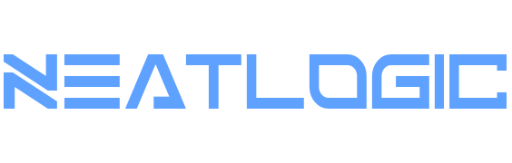

[中文](README.md) / English

## About

NeatLogic is a progressive ITOM platform designed to provide ITOM solutions for users of different types and scales. In addition to the community edition, we also offer enterprise clients secondary development, consulting, and related services. For inquiries, please contact zhangzm@neatlogic.com or join our Enterprise WeChat for further communication.

NeatLogic natively supports multi-tenancy (shared middleware with tenant-isolated databases), modular extensions, and already includes key core features such as a process engine, form engine, report engine, large screen, and dashboard. For functions sensitive to data scale—such as CMDB—the design has been carefully optimized to balance performance for both reporting and daily usage.
When using only the basic features, NeatLogic requires only Tomcat, Nginx, and MySQL 8+. Some advanced features, such as automatic data collection, require MongoDB.
NeatLogic provides both Docker image deployment and installation package deployment. All databases and middleware are included, with start/stop scripts for all key services. Middleware, software packages, and configuration files are fully separated for easier maintenance.

## License

NeatLogic is distributed under a Fair-code model, following the [Sustainable Use License](LICENSE.md) and the [NeatLogic Enterprise License](LICENSE.ee.md).
- Source Available: Source code is always visible.
- Self-Hostable: Can be deployed and used in any environment.
- Extensible: Supports adding custom modules to meet personalized needs.
- Enterprise License: Provides additional features and technical support.

## Runtime Environment
Operating System: Linux
Java Version: 17+
Process Memory: at least 4 GB (8 GB recommended)

## Dependent Components

| Component | Version | Required | Description |
|---|---|---|---|
| [Tomcat](https://tomcat.apache.org/) | 9.0.75 | ✅ | Servlet container |
| [MySQL](https://www.mysql.com/) | 8.0.27 | ✅ | Database |
| [Nginx](https://www.nginx-cn.net/) | 1.16.1 | ✅ | Front-end server |
| [MongoDB](https://www.mongodb.com/) | 7.x | ✖️ | Database for automatic collection and inspection definitions; required if using inspection or CMDB auto-collection features |
| [RustFs](https://rustfs.cn/) | latest | ✖️ | Attachment storage; if not deployed, it switches to local storage mode automatically. When multiple services share attachments, set the upload directory to a shared location (e.g., NAS). |
| [Nacos](https://nacos.io/zh-cn/) | 2.1.0 | ✖️ | Centralized configuration management; if not deployed, configurations will be read from the local `config.properties` file |
| [ActiveMQ Artemis](https://activemq.apache.org/components/artemis/) | 2.17.0 | ✖️ | Message queue supporting topic publishing and subscription; optional if no third-party systems consume messages |
| [Apache Kafka](https://kafka.apache.org/) | 3.8.0 | ✖️ | Message queue supporting only subscription; official features do not publish topics, but custom features can. Optional if not used. |
| [Elasticsearch](https://www.elastic.co/) | 8.17.4 | ✖️ | Currently used only in the Alert Center module; may be expanded in future releases |
| [Qdrant](https://qdrant.tech/) | 1.13.2 | ✖️ | Vector database, currently used only in the Alert Center module for similarity analysis; limited to commercial modules |

## Project Structure
NeatLogic manages code in a modular fashion.
* neatlogic-itom-all is convenient for users to obtain all codes at one time.
* neatlogic-parent is used to manage global pom files and manage all public third-party package references.
* neatlogic-webroot is used to generate war packages and manage submodule references. The pom file can be modified as needed to load different submodules to generate the final war package.
* neatlogic-springboot Springboot deployment mode, it allows for modifying the pom file as needed to load different sub-modules, generating the final jar package.
* neatlogic-framework is the basic module, all submodules need to refer to neatlogic-framework, and all submodules of neatlogic-framework beans can be woven into.
* neatlogic-tenant is the bean of the api part of the basic function, and other sub-modules are not visible.
* neatlogic-web is the front-end code.
* neatlogic-master is the backend code of the tenant management module, which is used to manage the tenant information of neatlogic.
* neatlogic-master-web is the front-end code of the tenant management module, which needs to be deployed separately from neatlogic-web during deployment.
* Each of the remaining functional modules needs to be split into two code modules, namely neatlogic-xxx and neatlogic-xxx-base. Since maven does not support cross-references, neatlogic-xxx-base is mainly used to be referenced by other modules, mainly for pojo and some low-level interfaces. neatlogic-xxx needs to reference neatlogic-xxx-base, which mainly contains its own exclusive business beans.


## Module list
| module | dependencies | description |
| --- | --- | --- |
| neatlogic-framework | | - Scheduled jobs: You can customize scheduled jobs through plug-ins. <br>- Integrated management: centralized management of third-party interfaces, format conversion of input and output parameters, and audit function. <br>- Health check: with slow sql location, online threaddump and other capabilities, database defragmentation capabilities. <br>- Index management: full-text search index management. <br>- Subscription management: docking with the third-party MQ system, the system's own MQ is Active MQ. Subscription topics can be extended through plug-ins. <br>- Others: user management, authority management, operation record auditing, etc. |
| neatlogic-cmdb | neatlogic-framework | - Automatic collection: Based on Tagent, API, and public protocols, automatically collect assets and asset relationships. <br>- Model management: asset data model, data relationship definition, maintenance. <br>- Configuration item management: daily maintenance of asset data. <br>- Batch import: Asset data batch import configuration management platform. <br>- Transaction audit: asset data changes, with the process engine and ITSM module can pre-approval process, after the approval is completed, the changes will take effect; all change records in the asset life cycle can be queried. <br>- Custom view: Create a custom virtual view by connecting multiple models to meet observation data in different dimensions. <br>- Permission group: flexible data permission strategy, users or roles, organizations can be selected, filter rules can be set for the specified model, and viewing and editing permissions can be configured. <br>- Resource Center: From the perspective of application and infrastructure, it provides the management page and consumption interface of IP assets, and also provides the account management function of IP assets. | section |
| neatlogic-itsm | neatlogic-framework |The unified reporting platform for operation and maintenance events is a process management platform for daily affairs such as service requests, events, problems, changes, knowledge bases, contracts, suppliers, etc.<br> - Custom Process: For different usage scenarios, customize the reporting process suitable for the current usage scenario. <br>- Custom form: Customize form components, layouts, and data sources for different usage scenarios. <br>- Service catalog management: plan user reporting channels, channel permissions, and channel association processes. <br>- SLA policy: service timeliness commitment, SLA policy can be flexibly configured according to combined condition information such as priority, reporting person, and form value. <br>- Work Order Center: Set user personalized filters and create personal directories. <br>- Assignment strategy: can be assigned to individuals, roles, and groups; assign strategies can be configured based on reported data, and work orders can be automatically assigned, such as assignment by application owner, assignment by workload, assignment by schedule. <br>- Knowledge base: automatically generate knowledge from work orders; knowledge templates; knowledge maintenance; set knowledge viewing and maintenance permissions through knowledge circle policies. | is |
| neatlogic-knowledge | neatlogic-framework | knowledge base module |
| neatlogic-event |neatlogic-framework, neatlogic-process |event management module, need to be used together with ITSM module |
| neatlogic-change | neatlogic-framework, neatlogic-process | change management module, need to be used together with ITSM module |
| neatlogic-autoexec | neatlogic-framework, neatlogic-cmdb |Automated and standardized daily operation and maintenance operation platform, which can be used for software installation, software start and stop, configuration backup, configuration check, configuration change, automatic collection, SQL execution, etc.<br> - Tool library: The platform comes with common tools that support software installation, software start and stop, configuration backup, configuration check, configuration change, automatic collection, SQL execution and other operations. <br>- Custom tool library: Create user-defined scripts to cover operation and maintenance scenarios other than the built-in tool library; support script approval and script version records. <br>- Arrangement management: custom tool arrangement, serial, parallel, conditional split, batch operation and other settings; arrangement approval, arrangement version control. <br>- Job process control: job start, pause, stop, rerun; real-time synchronization of script running logs; real-time synchronization of job scheduling logs. <br>- Global parameters/parameter files: commonly used parameters are pre-defined, and parameters can be imported with one click. <br>- Script/command delivery: self-contained agent; scripts and commands can also be delivered through public protocols. |
| neatlogic-deploy | neatlogic-framework, neatlogic-autoexec |Application automatic compilation, deployment, code merging<br>- Scenario coverage: start and stop, compile, deploy, rollback; support Docker. <br>- Application pipeline: custom pipeline; application, sub-application and environment support pipeline hierarchical inheritance. <br>- Pipeline scenario: Prune the complete pipeline and save it as multiple scenarios. An application only needs to configure one pipeline, and set the start, stop, restart, compile, compile&deploy, rollback and other scenarios. <br>- Configuration modification: support the overall replacement and partial replacement of configuration files in different environments. <br>- Product management: built-in product management library, support third-party product library such as nexus and so on. <br>- Version management: record version products, version releases in each environment, and version quality. <br>- Batch release: Pipeline arrangement, supports serial and parallel, can solve the problem of system release sequence dependency. <br>- Release process control: job start, pause, stop, rerun; real-time synchronization of script running logs; real-time synchronization of job scheduling logs. |
| neatlogic-dashboard | neatlogic-framework | Custom Dashboard |
| neatlogic-report | neatlogic-framework | custom report and large screen |
| neatlogic-pbc | neatlogic-framework、neatlogic-cmdb | Financial basic data reporting platform of the People's Bank of China (bank users just need it, other users can ignore it)|
| neatlogic-inspect | neatlogic-framework, neatlogic-autoexec | Daily inspection of operating systems, hardware servers, virtualization, middleware, databases, network devices, containers, storage devices and other infrastructure, discover potential risks and alert<br> - Application inspection: Check the health of all components of an application. <br>- Asset inspection: From the perspective of infrastructure management, such as checking the health of all network devices. <br>- Configuration file comparison: check configuration files of applications, servers, and services, and record configuration file change records. <br>- Custom Thresholds: Configure asset health indicator thresholds. <br>- Patrol inspection report: The inspection results are in the form of reports, archived and saved or exported for viewing. <br>- Latest Issues: In the full infrastructure, the collection of assets that currently have health issues and the report on the specific issues of each asset. |

## Quick start
* check out
   Check out neatlogic-itom-all to get all the module codes. Since neatlogic-itom-all uses submodule to import modules, you need to add the --recurse-submodules parameter when checking out the code. \example:
   ```
   git clone url --recurse-submodules
   ```

* online demo
preparing……

* docker deployment
[Click to view docker deployment manual](QUICK_START.en.md)

## Contact us
  [Neatlogic in Slack](https://join.slack.com/t/slack-lyi2045/shared_invite/zt-1sok6dlv5-WzpKDpnXQLXc92taC1qMFA)
