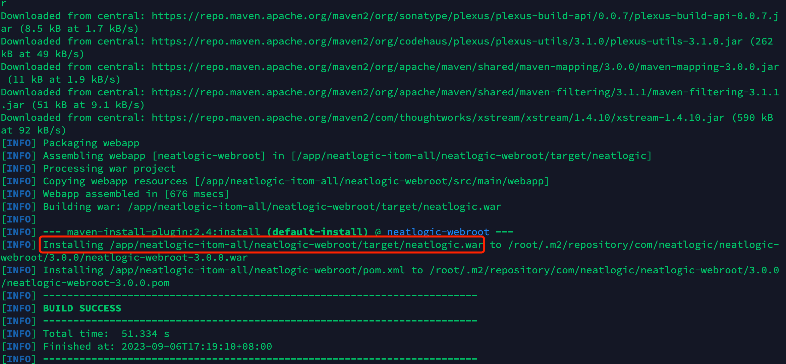
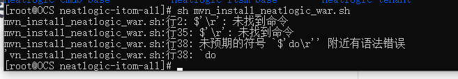

中文 / [English](WAR_INSTALL.en.md)

# 构建教程
## 构建前端vue
[点击查看](../../../neatlogic-web/blob/develop3.0.0/README.md)
## 构建后端tomcat服务war包
### 前提条件
先安装好jdk1.8、maven3.8+和git

# 1.拉取项目代码
```
git clone https://gitee.com/neat-logic/neatlogic-itom-all.git  --recurse-submodules
#切换分支
git submodule foreach 'git checkout develop3.0.0'
```
# 2.进入 neatlogic-itom-all 文件夹
```
cd neatlogic-itom-all
```
# 3.执行install脚本

将这个[mvn_install_neatlogic_war.sh](mvn_install_neatlogic_war.sh)脚本放到neatlogic-itom-all目录下

```
sh mvn_install_neatlogic_war.sh
```


# FAQ常见问题
## 脚本执行异常

因为脚本的换行符格式与你当前的操作系统不兼容。Unix/Linux系统使用的是LF（换行符），而Windows系统使用的是CRLF（回车换行符）。