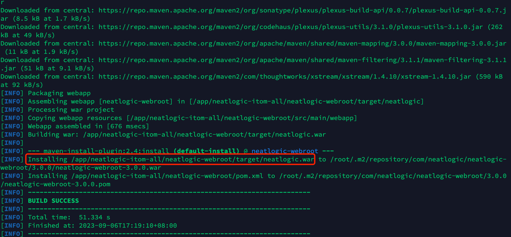
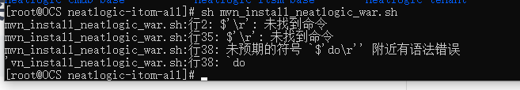

中文 / [English](WAR_INSTALL.en.md)

# 构建教程
## 拉取项目代码
```
git clone https://gitee.com/neat-logic/neatlogic-itom-all.git  --recurse-submodules
#切换分支
git submodule foreach 'git checkout develop3.0.0'
```

## 构建前端vue
### 安装使用v18.x版本的node
```
英文网址：https://nodejs.org/en/download
中文网址：https://nodejs.cn/en/download
```

### 设置淘宝镜像源
```
npm config set registry https://registry.npmmirror.com/
```

### 安装依赖
进入 neatlogic-itom-all/neatlogic-web 文件夹
```
cd neatlogic-itom-all/neatlogic-web
npm install
```
> 如果启动时发现大量不明报错，可能原因是npm install阶段加载的依赖包不完整导致，可以对npm进行降级再次install，目前测试v18的npm可以正常install。建议使用nvm管理多版本的node，使用v18.x版本的node会比较稳定。
### 构建打包项目dist
```
npm run build
```
# 支持pnpm
```js
 📌" 研发环境建议使用pnpm效率更高，生产出包使用npm。pnpm需自行科普使用"   
```

### 其它
#### 升降级级node版本

- 清理npm缓存：
```
npm cache clean -f
```
- 安装版本管理工具：
```
npm install -g n
```
- 升级到最新的版本：
```
n latest（最新版本）
n stable（最新稳定版本）
```
- 指定版本： 
```
n 18.16.0
```
#### 降低cnpm版本
1. 这里是列表文本先卸载cnpm 
```
npm uninstall -g cnpm
```
2. 这里是列表文本再安装低版本的cnpm 
```
npm install cnpm@8.2.0 -g --registry=https://registry.npm.taobao.org
```
#### 其它常用的命令
```
# 升级依赖包
npm update <package-name>

# 查看已安装的包
npm list
```
## 构建后端tomcat服务war包
### 前提条件
先安装好jdk1.8、maven3.8+和git

#### 1.进入 neatlogic-itom-all 文件夹
```
cd neatlogic-itom-all
```
#### 2.执行install脚本

将这个[mvn_install_neatlogic_war.sh](mvn_install_neatlogic_war.sh)脚本放到neatlogic-itom-all目录下

```
sh mvn_install_neatlogic_war.sh
```


#### FAQ常见问题
##### 脚本执行异常

因为脚本的换行符格式与你当前的操作系统不兼容。Unix/Linux系统使用的是LF（换行符），而Windows系统使用的是CRLF（回车换行符）。